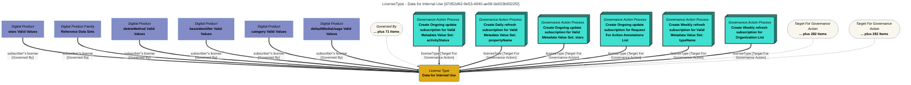

```mermaid
---
title: LicenseType - Data for Internal Use [d7d52d62-9e53-4940-ae08-0a503b9322f2]
---
flowchart TD
%%{init: {"flowchart": {"htmlLabels": false}} }%%

1@{ shape: rounded, label: "*License Type*
**Data for Internal Use**"}
2@{ shape: rect, label: "*Digital Product*
**stars Valid Values**"}
2==>|"subscriber''s license [Governed By]"|1
3@{ shape: rect, label: "*Digital Product Family*
**Reference Data Sets**"}
3==>|"subscriber''s license [Governed By]"|1
4@{ shape: rect, label: "*Digital Product*
**deleteMethod Valid Values**"}
4==>|"subscriber''s license [Governed By]"|1
5@{ shape: rect, label: "*Digital Product*
**basisIdentifier Valid Values**"}
5==>|"subscriber''s license [Governed By]"|1
6@{ shape: rect, label: "*Digital Product*
**category Valid Values**"}
6==>|"subscriber''s license [Governed By]"|1
7@{ shape: rect, label: "*Digital Product*
**defaultMediaUsage Valid Values**"}
7==>|"subscriber''s license [Governed By]"|1
8@{ shape: stadium, label: "*Governed By*
**... plus 71 Items**"}
8-.->1
9@{ shape: processes, label: "*Governance Action Process*
**Create Ongoing update subscription for Valid Metadata Value Set: activityStatus**"}
9==>|"licenseType [Target For Governance Action]"|1
10@{ shape: processes, label: "*Governance Action Process*
**Create Daily refresh subscription for Valid Metadata Value Set: propertyName**"}
10==>|"licenseType [Target For Governance Action]"|1
11@{ shape: processes, label: "*Governance Action Process*
**Create Ongoing update subscription for Valid Metadata Value Set: stars**"}
11==>|"licenseType [Target For Governance Action]"|1
12@{ shape: processes, label: "*Governance Action Process*
**Create Ongoing update subscription for Request For Action Annotations List**"}
12==>|"licenseType [Target For Governance Action]"|1
13@{ shape: processes, label: "*Governance Action Process*
**Create Weekly refresh subscription for Valid Metadata Value Set: typeName**"}
13==>|"licenseType [Target For Governance Action]"|1
14@{ shape: processes, label: "*Governance Action Process*
**Create Weekly refresh subscription for Organization List**"}
14==>|"licenseType [Target For Governance Action]"|1
15@{ shape: stadium, label: "*Target For Governance Action*
**... plus 282 Items**"}
15-.->1
16@{ shape: stadium, label: "*Target For Governance Action*
**... plus 282 Items**"}
16-.->1
style 11 color:#000000, fill:#40E0D0, stroke:#000000
style 12 color:#000000, fill:#40E0D0, stroke:#000000
style 13 color:#000000, fill:#40E0D0, stroke:#000000
style 14 color:#000000, fill:#40E0D0, stroke:#000000
style 15 color:#000000, fill:#F9F7ED, stroke:#b7c0c7
style 16 color:#000000, fill:#F9F7ED, stroke:#b7c0c7
style 1 color:#000000, fill:#e0ab18, stroke:#004563
style 2 color:#000000, fill:#838cc7, stroke:#3079ab
style 3 color:#000000, fill:#838cc7, stroke:#3079ab
style 4 color:#000000, fill:#838cc7, stroke:#3079ab
style 5 color:#000000, fill:#838cc7, stroke:#3079ab
style 6 color:#000000, fill:#838cc7, stroke:#3079ab
style 7 color:#000000, fill:#838cc7, stroke:#3079ab
style 8 color:#000000, fill:#F9F7ED, stroke:#b7c0c7
style 9 color:#000000, fill:#40E0D0, stroke:#000000
style 10 color:#000000, fill:#40E0D0, stroke:#000000
```
