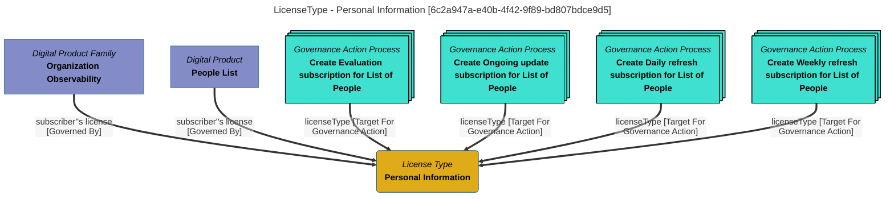

```mermaid
---
title: LicenseType - Personal Information [6c2a947a-e40b-4f42-9f89-bd807bdce9d5]
---
flowchart TD
%%{init: {"flowchart": {"htmlLabels": false}} }%%

1@{ shape: rounded, label: "*License Type*
**Personal Information**"}
2@{ shape: rect, label: "*Digital Product Family*
**Organization Observability**"}
2==>|"subscriber''s license [Governed By]"|1
3@{ shape: rect, label: "*Digital Product*
**People List**"}
3==>|"subscriber''s license [Governed By]"|1
4@{ shape: processes, label: "*Governance Action Process*
**Create Evaluation subscription for List of People**"}
4==>|"licenseType [Target For Governance Action]"|1
5@{ shape: processes, label: "*Governance Action Process*
**Create Ongoing update subscription for List of People**"}
5==>|"licenseType [Target For Governance Action]"|1
6@{ shape: processes, label: "*Governance Action Process*
**Create Daily refresh subscription for List of People**"}
6==>|"licenseType [Target For Governance Action]"|1
7@{ shape: processes, label: "*Governance Action Process*
**Create Weekly refresh subscription for List of People**"}
7==>|"licenseType [Target For Governance Action]"|1
style 1 color:#000000, fill:#e0ab18, stroke:#004563
style 2 color:#000000, fill:#838cc7, stroke:#3079ab
style 3 color:#000000, fill:#838cc7, stroke:#3079ab
style 4 color:#000000, fill:#40E0D0, stroke:#000000
style 5 color:#000000, fill:#40E0D0, stroke:#000000
style 6 color:#000000, fill:#40E0D0, stroke:#000000
style 7 color:#000000, fill:#40E0D0, stroke:#000000
```
