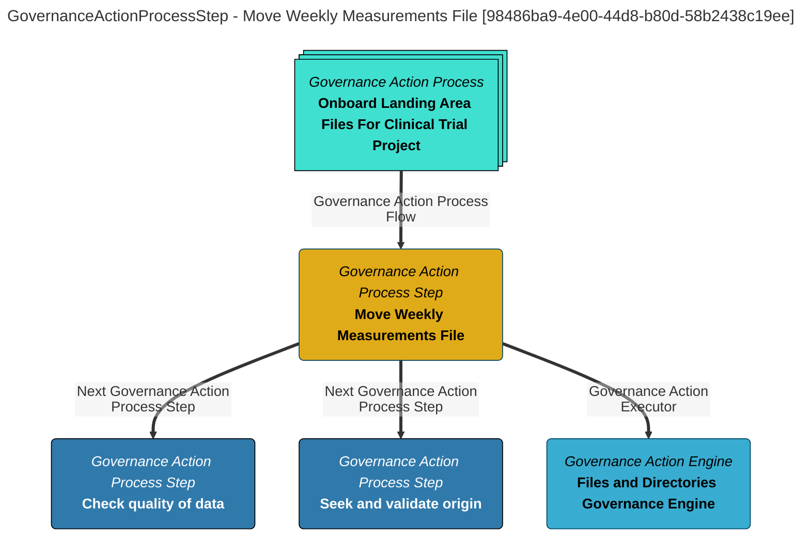

```mermaid
---
title: GovernanceActionProcessStep - Move Weekly Measurements File [98486ba9-4e00-44d8-b80d-58b2438c19ee]
---
flowchart TD
%%{init: {"flowchart": {"htmlLabels": false}} }%%

1@{ shape: rounded, label: "*Governance Action Process Step*
**Move Weekly Measurements File**"}
2@{ shape: processes, label: "*Governance Action Process*
**Onboard Landing Area Files For Clinical Trial Project**"}
2==>|"Governance Action Process Flow"|1
3@{ shape: rounded, label: "*Governance Action Process Step*
**Check quality of data**"}
1==>|"Next Governance Action Process Step"|3
4@{ shape: rounded, label: "*Governance Action Process Step*
**Seek and validate origin**"}
1==>|"Next Governance Action Process Step"|4
5@{ shape: rounded, label: "*Governance Action Engine*
**Files and Directories Governance Engine**"}
1==>|"Governance Action Executor"|5
style 1 color:#000000, fill:#e0ab18, stroke:#004563
style 2 color:#000000, fill:#40E0D0, stroke:#000000
style 3 color:#FFFFFF, fill:#3079ab, stroke:#000000
style 4 color:#FFFFFF, fill:#3079ab, stroke:#000000
style 5 color:#000000, fill:#39add1, stroke:#004563
click 2 "https://egeria-project.org/egeria-solutions/leveraging-files/overview/" "Click for more documentation" _blank
```
