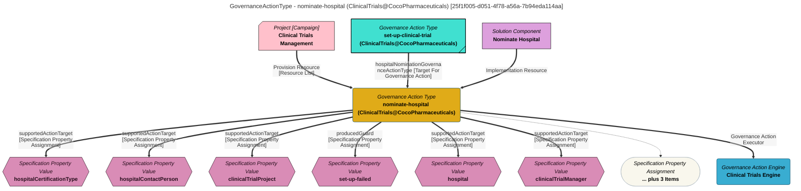

```mermaid
---
title: GovernanceActionType - nominate-hospital (ClinicalTrials@CocoPharmaceuticals) [25f1f005-d051-4f78-a56a-7b94eda114aa]
---
flowchart TD
%%{init: {"flowchart": {"htmlLabels": false}} }%%

1@{ shape: rounded, label: "*Governance Action Type*
**nominate-hospital (ClinicalTrials@CocoPharmaceuticals)**"}
2@{ shape: notch-rect, label: "*Project [Campaign]*
**Clinical Trials Management**"}
2==>|"Provision Resource [Resource List]"|1
3@{ shape: tag-rect, label: "*Governance Action Type*
**set-up-clinical-trial (ClinicalTrials@CocoPharmaceuticals)**"}
3==>|"hospitalNominationGovernanceActionType [Target For Governance Action]"|1
4@{ shape: hex, label: "*Specification Property Value*
**hospitalCertificationType**"}
1==>|"supportedActionTarget [Specification Property Assignment]"|4
5@{ shape: hex, label: "*Specification Property Value*
**hospitalContactPerson**"}
1==>|"supportedActionTarget [Specification Property Assignment]"|5
6@{ shape: hex, label: "*Specification Property Value*
**clinicalTrialProject**"}
1==>|"supportedActionTarget [Specification Property Assignment]"|6
7@{ shape: hex, label: "*Specification Property Value*
**set-up-failed**"}
1==>|"producedGuard [Specification Property Assignment]"|7
8@{ shape: hex, label: "*Specification Property Value*
**hospital**"}
1==>|"supportedActionTarget [Specification Property Assignment]"|8
9@{ shape: hex, label: "*Specification Property Value*
**clinicalTrialManager**"}
1==>|"supportedActionTarget [Specification Property Assignment]"|9
10@{ shape: stadium, label: "*Specification Property Assignment*
**... plus 3 Items**"}
1-.->10
11@{ shape: rect, label: "*Solution Component*
**Nominate Hospital**"}
11==>|"Implementation Resource"|1
12@{ shape: rounded, label: "*Governance Action Engine*
**Clinical Trials Engine**"}
1==>|"Governance Action Executor"|12
style 11 color:#000000, fill:#DDA0DD, stroke:#000000
style 1 color:#000000, fill:#e0ab18, stroke:#004563
style 12 color:#000000, fill:#39add1, stroke:#004563
style 2 color:#000000, fill:#FFC0CB, stroke:#000000
style 3 color:#000000, fill:#40E0D0, stroke:#000000
style 4 color:#260d1b, fill:#d98cb6, stroke:#260d1b
style 5 color:#260d1b, fill:#d98cb6, stroke:#260d1b
style 6 color:#260d1b, fill:#d98cb6, stroke:#260d1b
style 7 color:#260d1b, fill:#d98cb6, stroke:#260d1b
style 8 color:#260d1b, fill:#d98cb6, stroke:#260d1b
style 9 color:#260d1b, fill:#d98cb6, stroke:#260d1b
style 10 color:#000000, fill:#F9F7ED, stroke:#b7c0c7
```
