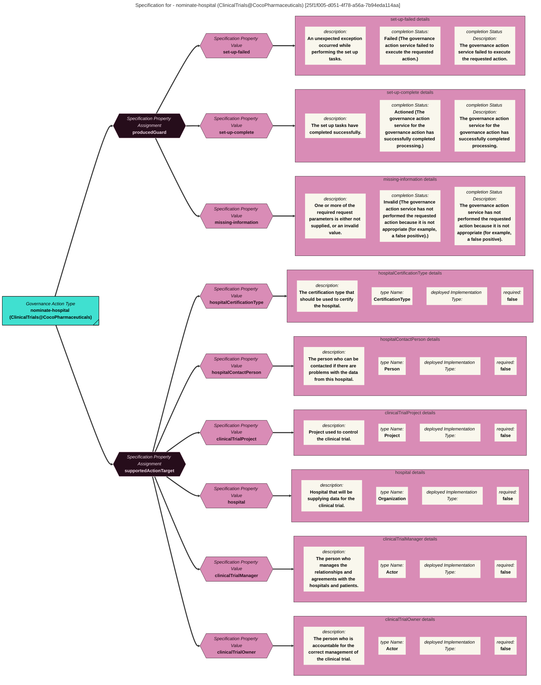

```mermaid
---
title: Specification for - nominate-hospital (ClinicalTrials@CocoPharmaceuticals) [25f1f005-d051-4f78-a56a-7b94eda114aa]
---
flowchart LR
%%{init: {"flowchart": {"htmlLabels": false}} }%%

1@{ shape: tag-rect, label: "*Governance Action Type*
**nominate-hospital (ClinicalTrials@CocoPharmaceuticals)**"}
2@{ shape: hex, label: "*Specification Property Assignment*
**producedGuard**"}
1==>2
3@{ shape: hex, label: "*Specification Property Value*
**set-up-failed**"}
2==>3
subgraph 4 [set-up-failed details]
5@{ shape: text, label: "*description:*
**An unexpected exception occurred while performing the set up tasks.**"}
6@{ shape: text, label: "*completion Status:*
**Failed (The governance action service failed to execute the requested action.)**"}
7@{ shape: text, label: "*completion Status Description:*
**The governance action service failed to execute the requested action.**"}
end
3==>4
8@{ shape: hex, label: "*Specification Property Value*
**set-up-complete**"}
2==>8
subgraph 9 [set-up-complete details]
10@{ shape: text, label: "*description:*
**The set up tasks have completed successfully.**"}
11@{ shape: text, label: "*completion Status:*
**Actioned (The governance action service for the governance action has successfully completed processing.)**"}
12@{ shape: text, label: "*completion Status Description:*
**The governance action service for the governance action has successfully completed processing.**"}
end
8==>9
13@{ shape: hex, label: "*Specification Property Value*
**missing-information**"}
2==>13
subgraph 14 [missing-information details]
15@{ shape: text, label: "*description:*
**One or more of the required request parameters is either not supplied, or an invalid value.**"}
16@{ shape: text, label: "*completion Status:*
**Invalid (The governance action service has not performed the requested action because it is not appropriate (for example, a false positive).)**"}
17@{ shape: text, label: "*completion Status Description:*
**The governance action service has not performed the requested action because it is not appropriate (for example, a false positive).**"}
end
13==>14
18@{ shape: hex, label: "*Specification Property Assignment*
**supportedActionTarget**"}
1==>18
19@{ shape: hex, label: "*Specification Property Value*
**hospitalCertificationType**"}
18==>19
subgraph 20 [hospitalCertificationType details]
21@{ shape: text, label: "*description:*
**The certification type that should be used to certify the hospital.**"}
22@{ shape: text, label: "*type Name:*
**CertificationType**"}
23@{ shape: text, label: "*deployed Implementation Type:*
"}
24@{ shape: text, label: "*required:*
**false**"}
end
19==>20
25@{ shape: hex, label: "*Specification Property Value*
**hospitalContactPerson**"}
18==>25
subgraph 26 [hospitalContactPerson details]
27@{ shape: text, label: "*description:*
**The person who can be contacted if there are problems with the data from this hospital.**"}
28@{ shape: text, label: "*type Name:*
**Person**"}
29@{ shape: text, label: "*deployed Implementation Type:*
"}
30@{ shape: text, label: "*required:*
**false**"}
end
25==>26
31@{ shape: hex, label: "*Specification Property Value*
**clinicalTrialProject**"}
18==>31
subgraph 32 [clinicalTrialProject details]
33@{ shape: text, label: "*description:*
**Project used to control the clinical trial.**"}
34@{ shape: text, label: "*type Name:*
**Project**"}
35@{ shape: text, label: "*deployed Implementation Type:*
"}
36@{ shape: text, label: "*required:*
**false**"}
end
31==>32
37@{ shape: hex, label: "*Specification Property Value*
**hospital**"}
18==>37
subgraph 38 [hospital details]
39@{ shape: text, label: "*description:*
**Hospital that will be supplying data for the clinical trial.**"}
40@{ shape: text, label: "*type Name:*
**Organization**"}
41@{ shape: text, label: "*deployed Implementation Type:*
"}
42@{ shape: text, label: "*required:*
**false**"}
end
37==>38
43@{ shape: hex, label: "*Specification Property Value*
**clinicalTrialManager**"}
18==>43
subgraph 44 [clinicalTrialManager details]
45@{ shape: text, label: "*description:*
**The person who manages the relationships and agreements with the hospitals and patients.**"}
46@{ shape: text, label: "*type Name:*
**Actor**"}
47@{ shape: text, label: "*deployed Implementation Type:*
"}
48@{ shape: text, label: "*required:*
**false**"}
end
43==>44
49@{ shape: hex, label: "*Specification Property Value*
**clinicalTrialOwner**"}
18==>49
subgraph 50 [clinicalTrialOwner details]
51@{ shape: text, label: "*description:*
**The person who is accountable for the correct management of the clinical trial.**"}
52@{ shape: text, label: "*type Name:*
**Actor**"}
53@{ shape: text, label: "*deployed Implementation Type:*
"}
54@{ shape: text, label: "*required:*
**false**"}
end
49==>50
style 44 color:#260d1b, fill:#d98cb6, stroke:#260d1b
style 45 color:#000000, fill:#F9F7ED, stroke:#b7c0c7
style 46 color:#000000, fill:#F9F7ED, stroke:#b7c0c7
style 47 color:#000000, fill:#F9F7ED, stroke:#b7c0c7
style 48 color:#000000, fill:#F9F7ED, stroke:#b7c0c7
style 49 color:#260d1b, fill:#d98cb6, stroke:#260d1b
style 50 color:#260d1b, fill:#d98cb6, stroke:#260d1b
style 51 color:#000000, fill:#F9F7ED, stroke:#b7c0c7
style 52 color:#000000, fill:#F9F7ED, stroke:#b7c0c7
style 53 color:#000000, fill:#F9F7ED, stroke:#b7c0c7
style 10 color:#000000, fill:#F9F7ED, stroke:#b7c0c7
style 54 color:#000000, fill:#F9F7ED, stroke:#b7c0c7
style 11 color:#000000, fill:#F9F7ED, stroke:#b7c0c7
style 12 color:#000000, fill:#F9F7ED, stroke:#b7c0c7
style 13 color:#260d1b, fill:#d98cb6, stroke:#260d1b
style 14 color:#260d1b, fill:#d98cb6, stroke:#260d1b
style 15 color:#000000, fill:#F9F7ED, stroke:#b7c0c7
style 16 color:#000000, fill:#F9F7ED, stroke:#b7c0c7
style 17 color:#000000, fill:#F9F7ED, stroke:#b7c0c7
style 18 color:#f2d9e7, fill:#260d1b, stroke:#f2d9e7
style 19 color:#260d1b, fill:#d98cb6, stroke:#260d1b
style 1 color:#000000, fill:#40E0D0, stroke:#000000
style 2 color:#f2d9e7, fill:#260d1b, stroke:#f2d9e7
style 3 color:#260d1b, fill:#d98cb6, stroke:#260d1b
style 4 color:#260d1b, fill:#d98cb6, stroke:#260d1b
style 5 color:#000000, fill:#F9F7ED, stroke:#b7c0c7
style 6 color:#000000, fill:#F9F7ED, stroke:#b7c0c7
style 7 color:#000000, fill:#F9F7ED, stroke:#b7c0c7
style 8 color:#260d1b, fill:#d98cb6, stroke:#260d1b
style 9 color:#260d1b, fill:#d98cb6, stroke:#260d1b
style 20 color:#260d1b, fill:#d98cb6, stroke:#260d1b
style 21 color:#000000, fill:#F9F7ED, stroke:#b7c0c7
style 22 color:#000000, fill:#F9F7ED, stroke:#b7c0c7
style 23 color:#000000, fill:#F9F7ED, stroke:#b7c0c7
style 24 color:#000000, fill:#F9F7ED, stroke:#b7c0c7
style 25 color:#260d1b, fill:#d98cb6, stroke:#260d1b
style 26 color:#260d1b, fill:#d98cb6, stroke:#260d1b
style 27 color:#000000, fill:#F9F7ED, stroke:#b7c0c7
style 28 color:#000000, fill:#F9F7ED, stroke:#b7c0c7
style 29 color:#000000, fill:#F9F7ED, stroke:#b7c0c7
style 30 color:#000000, fill:#F9F7ED, stroke:#b7c0c7
style 31 color:#260d1b, fill:#d98cb6, stroke:#260d1b
style 32 color:#260d1b, fill:#d98cb6, stroke:#260d1b
style 33 color:#000000, fill:#F9F7ED, stroke:#b7c0c7
style 34 color:#000000, fill:#F9F7ED, stroke:#b7c0c7
style 35 color:#000000, fill:#F9F7ED, stroke:#b7c0c7
style 36 color:#000000, fill:#F9F7ED, stroke:#b7c0c7
style 37 color:#260d1b, fill:#d98cb6, stroke:#260d1b
style 38 color:#260d1b, fill:#d98cb6, stroke:#260d1b
style 39 color:#000000, fill:#F9F7ED, stroke:#b7c0c7
style 40 color:#000000, fill:#F9F7ED, stroke:#b7c0c7
style 41 color:#000000, fill:#F9F7ED, stroke:#b7c0c7
style 42 color:#000000, fill:#F9F7ED, stroke:#b7c0c7
style 43 color:#260d1b, fill:#d98cb6, stroke:#260d1b
```
