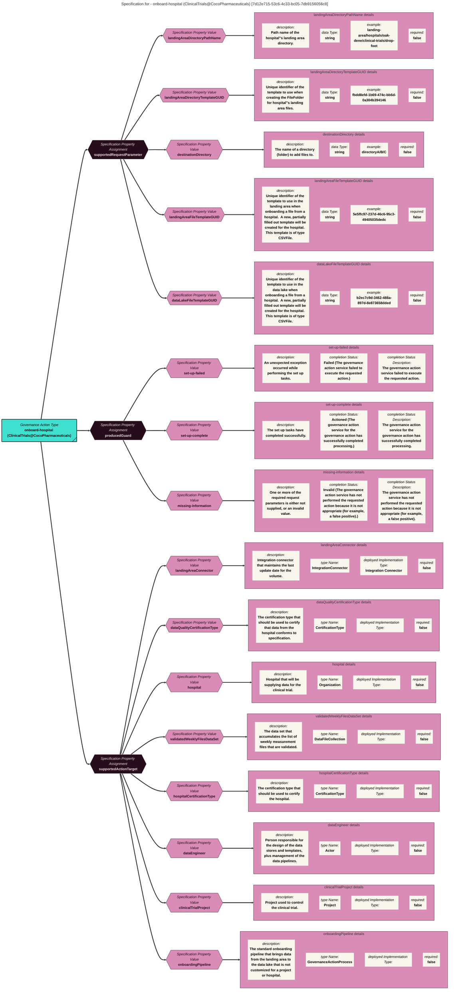

```mermaid
---
title: Specification for - onboard-hospital (ClinicalTrials@CocoPharmaceuticals) [7d12e715-53c6-4c33-bc05-7db9156056c8]
---
flowchart LR
%%{init: {"flowchart": {"htmlLabels": false}} }%%

1@{ shape: tag-rect, label: "*Governance Action Type*
**onboard-hospital (ClinicalTrials@CocoPharmaceuticals)**"}
2@{ shape: hex, label: "*Specification Property Assignment*
**supportedRequestParameter**"}
1==>2
3@{ shape: hex, label: "*Specification Property Value*
**landingAreaDirectoryPathName**"}
2==>3
subgraph 4 [landingAreaDirectoryPathName details]
5@{ shape: text, label: "*description:*
**Path name of the hospital''s landing area directory.**"}
6@{ shape: text, label: "*data Type:*
**string**"}
7@{ shape: text, label: "*example:*
**landing-area/hospitals/oak-dene/clinical-trials/drop-foot**"}
8@{ shape: text, label: "*required:*
**false**"}
end
3==>4
9@{ shape: hex, label: "*Specification Property Value*
**landingAreaDirectoryTemplateGUID**"}
2==>9
subgraph 10 [landingAreaDirectoryTemplateGUID details]
11@{ shape: text, label: "*description:*
**Unique identifier of the template to use when creating the FileFolder for hospital''s landing area files.**"}
12@{ shape: text, label: "*data Type:*
**string**"}
13@{ shape: text, label: "*example:*
**fbdd8efd-1b69-474c-bb6d-0a304b394146**"}
14@{ shape: text, label: "*required:*
**false**"}
end
9==>10
15@{ shape: hex, label: "*Specification Property Value*
**destinationDirectory**"}
2==>15
subgraph 16 [destinationDirectory details]
17@{ shape: text, label: "*description:*
**The name of a directory (folder) to add files to.**"}
18@{ shape: text, label: "*data Type:*
**string**"}
19@{ shape: text, label: "*example:*
**directoryA/B/C**"}
20@{ shape: text, label: "*required:*
**false**"}
end
15==>16
21@{ shape: hex, label: "*Specification Property Value*
**landingAreaFileTemplateGUID**"}
2==>21
subgraph 22 [landingAreaFileTemplateGUID details]
23@{ shape: text, label: "*description:*
**Unique identifier of the template to use in the landing area when onboarding a file from a hospital.  A new, partially filled out template will be created for the hospital.  This template is of type CSVFile.**"}
24@{ shape: text, label: "*data Type:*
**string**"}
25@{ shape: text, label: "*example:*
**5e5ffc97-237d-46c6-95c3-49405035dedc**"}
26@{ shape: text, label: "*required:*
**false**"}
end
21==>22
27@{ shape: hex, label: "*Specification Property Value*
**dataLakeFileTemplateGUID**"}
2==>27
subgraph 28 [dataLakeFileTemplateGUID details]
29@{ shape: text, label: "*description:*
**Unique identifier of the template to use in the data lake when onboarding a file from a hospital.  A new, partially filled out template will be created for the hospital.  This template is of type CSVFile.**"}
30@{ shape: text, label: "*data Type:*
**string**"}
31@{ shape: text, label: "*example:*
**b2ec7c9d-3462-488a-897d-8e873658dded**"}
32@{ shape: text, label: "*required:*
**false**"}
end
27==>28
33@{ shape: hex, label: "*Specification Property Assignment*
**producedGuard**"}
1==>33
34@{ shape: hex, label: "*Specification Property Value*
**set-up-failed**"}
33==>34
subgraph 35 [set-up-failed details]
36@{ shape: text, label: "*description:*
**An unexpected exception occurred while performing the set up tasks.**"}
37@{ shape: text, label: "*completion Status:*
**Failed (The governance action service failed to execute the requested action.)**"}
38@{ shape: text, label: "*completion Status Description:*
**The governance action service failed to execute the requested action.**"}
end
34==>35
39@{ shape: hex, label: "*Specification Property Value*
**set-up-complete**"}
33==>39
subgraph 40 [set-up-complete details]
41@{ shape: text, label: "*description:*
**The set up tasks have completed successfully.**"}
42@{ shape: text, label: "*completion Status:*
**Actioned (The governance action service for the governance action has successfully completed processing.)**"}
43@{ shape: text, label: "*completion Status Description:*
**The governance action service for the governance action has successfully completed processing.**"}
end
39==>40
44@{ shape: hex, label: "*Specification Property Value*
**missing-information**"}
33==>44
subgraph 45 [missing-information details]
46@{ shape: text, label: "*description:*
**One or more of the required request parameters is either not supplied, or an invalid value.**"}
47@{ shape: text, label: "*completion Status:*
**Invalid (The governance action service has not performed the requested action because it is not appropriate (for example, a false positive).)**"}
48@{ shape: text, label: "*completion Status Description:*
**The governance action service has not performed the requested action because it is not appropriate (for example, a false positive).**"}
end
44==>45
49@{ shape: hex, label: "*Specification Property Assignment*
**supportedActionTarget**"}
1==>49
50@{ shape: hex, label: "*Specification Property Value*
**landingAreaConnector**"}
49==>50
subgraph 51 [landingAreaConnector details]
52@{ shape: text, label: "*description:*
**Integration connector that maintains the last update date for the volume.**"}
53@{ shape: text, label: "*type Name:*
**IntegrationConnector**"}
54@{ shape: text, label: "*deployed Implementation Type:*
**Integration Connector**"}
55@{ shape: text, label: "*required:*
**false**"}
end
50==>51
56@{ shape: hex, label: "*Specification Property Value*
**dataQualityCertificationType**"}
49==>56
subgraph 57 [dataQualityCertificationType details]
58@{ shape: text, label: "*description:*
**The certification type that should be used to certify that data from the hospital conforms to specification.**"}
59@{ shape: text, label: "*type Name:*
**CertificationType**"}
60@{ shape: text, label: "*deployed Implementation Type:*
"}
61@{ shape: text, label: "*required:*
**false**"}
end
56==>57
62@{ shape: hex, label: "*Specification Property Value*
**hospital**"}
49==>62
subgraph 63 [hospital details]
64@{ shape: text, label: "*description:*
**Hospital that will be supplying data for the clinical trial.**"}
65@{ shape: text, label: "*type Name:*
**Organization**"}
66@{ shape: text, label: "*deployed Implementation Type:*
"}
67@{ shape: text, label: "*required:*
**false**"}
end
62==>63
68@{ shape: hex, label: "*Specification Property Value*
**validatedWeeklyFilesDataSet**"}
49==>68
subgraph 69 [validatedWeeklyFilesDataSet details]
70@{ shape: text, label: "*description:*
**The data set that accumulates the list of weekly measurement files that are validated.**"}
71@{ shape: text, label: "*type Name:*
**DataFileCollection**"}
72@{ shape: text, label: "*deployed Implementation Type:*
"}
73@{ shape: text, label: "*required:*
**false**"}
end
68==>69
74@{ shape: hex, label: "*Specification Property Value*
**hospitalCertificationType**"}
49==>74
subgraph 75 [hospitalCertificationType details]
76@{ shape: text, label: "*description:*
**The certification type that should be used to certify the hospital.**"}
77@{ shape: text, label: "*type Name:*
**CertificationType**"}
78@{ shape: text, label: "*deployed Implementation Type:*
"}
79@{ shape: text, label: "*required:*
**false**"}
end
74==>75
80@{ shape: hex, label: "*Specification Property Value*
**dataEngineer**"}
49==>80
subgraph 81 [dataEngineer details]
82@{ shape: text, label: "*description:*
**Person responsible for the design of the data stores and templates, plus management of the data pipelines.**"}
83@{ shape: text, label: "*type Name:*
**Actor**"}
84@{ shape: text, label: "*deployed Implementation Type:*
"}
85@{ shape: text, label: "*required:*
**false**"}
end
80==>81
86@{ shape: hex, label: "*Specification Property Value*
**clinicalTrialProject**"}
49==>86
subgraph 87 [clinicalTrialProject details]
88@{ shape: text, label: "*description:*
**Project used to control the clinical trial.**"}
89@{ shape: text, label: "*type Name:*
**Project**"}
90@{ shape: text, label: "*deployed Implementation Type:*
"}
91@{ shape: text, label: "*required:*
**false**"}
end
86==>87
92@{ shape: hex, label: "*Specification Property Value*
**onboardingPipeline**"}
49==>92
subgraph 93 [onboardingPipeline details]
94@{ shape: text, label: "*description:*
**The standard onboarding pipeline that brings data from the landing area to the data lake that is not customized for a project or hospital.**"}
95@{ shape: text, label: "*type Name:*
**GovernanceActionProcess**"}
96@{ shape: text, label: "*deployed Implementation Type:*
"}
97@{ shape: text, label: "*required:*
**false**"}
end
92==>93
style 88 color:#000000, fill:#F9F7ED, stroke:#b7c0c7
style 89 color:#000000, fill:#F9F7ED, stroke:#b7c0c7
style 90 color:#000000, fill:#F9F7ED, stroke:#b7c0c7
style 91 color:#000000, fill:#F9F7ED, stroke:#b7c0c7
style 92 color:#260d1b, fill:#d98cb6, stroke:#260d1b
style 93 color:#260d1b, fill:#d98cb6, stroke:#260d1b
style 94 color:#000000, fill:#F9F7ED, stroke:#b7c0c7
style 95 color:#000000, fill:#F9F7ED, stroke:#b7c0c7
style 96 color:#000000, fill:#F9F7ED, stroke:#b7c0c7
style 97 color:#000000, fill:#F9F7ED, stroke:#b7c0c7
style 10 color:#260d1b, fill:#d98cb6, stroke:#260d1b
style 11 color:#000000, fill:#F9F7ED, stroke:#b7c0c7
style 12 color:#000000, fill:#F9F7ED, stroke:#b7c0c7
style 13 color:#000000, fill:#F9F7ED, stroke:#b7c0c7
style 14 color:#000000, fill:#F9F7ED, stroke:#b7c0c7
style 15 color:#260d1b, fill:#d98cb6, stroke:#260d1b
style 16 color:#260d1b, fill:#d98cb6, stroke:#260d1b
style 17 color:#000000, fill:#F9F7ED, stroke:#b7c0c7
style 18 color:#000000, fill:#F9F7ED, stroke:#b7c0c7
style 19 color:#000000, fill:#F9F7ED, stroke:#b7c0c7
style 1 color:#000000, fill:#40E0D0, stroke:#000000
style 2 color:#f2d9e7, fill:#260d1b, stroke:#f2d9e7
style 3 color:#260d1b, fill:#d98cb6, stroke:#260d1b
style 4 color:#260d1b, fill:#d98cb6, stroke:#260d1b
style 5 color:#000000, fill:#F9F7ED, stroke:#b7c0c7
style 6 color:#000000, fill:#F9F7ED, stroke:#b7c0c7
style 7 color:#000000, fill:#F9F7ED, stroke:#b7c0c7
style 8 color:#000000, fill:#F9F7ED, stroke:#b7c0c7
style 9 color:#260d1b, fill:#d98cb6, stroke:#260d1b
style 20 color:#000000, fill:#F9F7ED, stroke:#b7c0c7
style 21 color:#260d1b, fill:#d98cb6, stroke:#260d1b
style 22 color:#260d1b, fill:#d98cb6, stroke:#260d1b
style 23 color:#000000, fill:#F9F7ED, stroke:#b7c0c7
style 24 color:#000000, fill:#F9F7ED, stroke:#b7c0c7
style 25 color:#000000, fill:#F9F7ED, stroke:#b7c0c7
style 26 color:#000000, fill:#F9F7ED, stroke:#b7c0c7
style 27 color:#260d1b, fill:#d98cb6, stroke:#260d1b
style 28 color:#260d1b, fill:#d98cb6, stroke:#260d1b
style 29 color:#000000, fill:#F9F7ED, stroke:#b7c0c7
style 30 color:#000000, fill:#F9F7ED, stroke:#b7c0c7
style 31 color:#000000, fill:#F9F7ED, stroke:#b7c0c7
style 32 color:#000000, fill:#F9F7ED, stroke:#b7c0c7
style 33 color:#f2d9e7, fill:#260d1b, stroke:#f2d9e7
style 34 color:#260d1b, fill:#d98cb6, stroke:#260d1b
style 35 color:#260d1b, fill:#d98cb6, stroke:#260d1b
style 36 color:#000000, fill:#F9F7ED, stroke:#b7c0c7
style 37 color:#000000, fill:#F9F7ED, stroke:#b7c0c7
style 38 color:#000000, fill:#F9F7ED, stroke:#b7c0c7
style 39 color:#260d1b, fill:#d98cb6, stroke:#260d1b
style 40 color:#260d1b, fill:#d98cb6, stroke:#260d1b
style 41 color:#000000, fill:#F9F7ED, stroke:#b7c0c7
style 42 color:#000000, fill:#F9F7ED, stroke:#b7c0c7
style 43 color:#000000, fill:#F9F7ED, stroke:#b7c0c7
style 44 color:#260d1b, fill:#d98cb6, stroke:#260d1b
style 45 color:#260d1b, fill:#d98cb6, stroke:#260d1b
style 46 color:#000000, fill:#F9F7ED, stroke:#b7c0c7
style 47 color:#000000, fill:#F9F7ED, stroke:#b7c0c7
style 48 color:#000000, fill:#F9F7ED, stroke:#b7c0c7
style 49 color:#f2d9e7, fill:#260d1b, stroke:#f2d9e7
style 50 color:#260d1b, fill:#d98cb6, stroke:#260d1b
style 51 color:#260d1b, fill:#d98cb6, stroke:#260d1b
style 52 color:#000000, fill:#F9F7ED, stroke:#b7c0c7
style 53 color:#000000, fill:#F9F7ED, stroke:#b7c0c7
style 54 color:#000000, fill:#F9F7ED, stroke:#b7c0c7
style 55 color:#000000, fill:#F9F7ED, stroke:#b7c0c7
style 56 color:#260d1b, fill:#d98cb6, stroke:#260d1b
style 57 color:#260d1b, fill:#d98cb6, stroke:#260d1b
style 58 color:#000000, fill:#F9F7ED, stroke:#b7c0c7
style 59 color:#000000, fill:#F9F7ED, stroke:#b7c0c7
style 60 color:#000000, fill:#F9F7ED, stroke:#b7c0c7
style 61 color:#000000, fill:#F9F7ED, stroke:#b7c0c7
style 62 color:#260d1b, fill:#d98cb6, stroke:#260d1b
style 63 color:#260d1b, fill:#d98cb6, stroke:#260d1b
style 64 color:#000000, fill:#F9F7ED, stroke:#b7c0c7
style 65 color:#000000, fill:#F9F7ED, stroke:#b7c0c7
style 66 color:#000000, fill:#F9F7ED, stroke:#b7c0c7
style 67 color:#000000, fill:#F9F7ED, stroke:#b7c0c7
style 68 color:#260d1b, fill:#d98cb6, stroke:#260d1b
style 69 color:#260d1b, fill:#d98cb6, stroke:#260d1b
style 70 color:#000000, fill:#F9F7ED, stroke:#b7c0c7
style 71 color:#000000, fill:#F9F7ED, stroke:#b7c0c7
style 72 color:#000000, fill:#F9F7ED, stroke:#b7c0c7
style 73 color:#000000, fill:#F9F7ED, stroke:#b7c0c7
style 74 color:#260d1b, fill:#d98cb6, stroke:#260d1b
style 75 color:#260d1b, fill:#d98cb6, stroke:#260d1b
style 76 color:#000000, fill:#F9F7ED, stroke:#b7c0c7
style 77 color:#000000, fill:#F9F7ED, stroke:#b7c0c7
style 78 color:#000000, fill:#F9F7ED, stroke:#b7c0c7
style 79 color:#000000, fill:#F9F7ED, stroke:#b7c0c7
style 80 color:#260d1b, fill:#d98cb6, stroke:#260d1b
style 81 color:#260d1b, fill:#d98cb6, stroke:#260d1b
style 82 color:#000000, fill:#F9F7ED, stroke:#b7c0c7
style 83 color:#000000, fill:#F9F7ED, stroke:#b7c0c7
style 84 color:#000000, fill:#F9F7ED, stroke:#b7c0c7
style 85 color:#000000, fill:#F9F7ED, stroke:#b7c0c7
style 86 color:#260d1b, fill:#d98cb6, stroke:#260d1b
style 87 color:#260d1b, fill:#d98cb6, stroke:#260d1b
```
