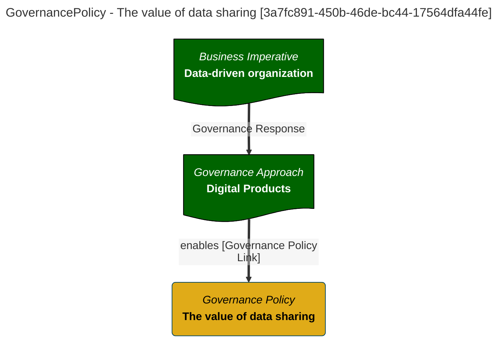

```mermaid
---
title: GovernancePolicy - The value of data sharing [3a7fc891-450b-46de-bc44-17564dfa44fe]
---
flowchart TD
%%{init: {"flowchart": {"htmlLabels": false}} }%%

1@{ shape: rounded, label: "*Governance Policy*
**The value of data sharing**"}
2@{ shape: doc, label: "*Governance Approach*
**Digital Products**"}
2==>|"enables [Governance Policy Link]"|1
3@{ shape: doc, label: "*Business Imperative*
**Data-driven organization**"}
3==>|"Governance Response"|2
style 1 color:#000000, fill:#e0ab18, stroke:#004563
style 2 color:#FFFFFF, fill:#006400, stroke:#000000
style 3 color:#FFFFFF, fill:#006400, stroke:#000000
```
