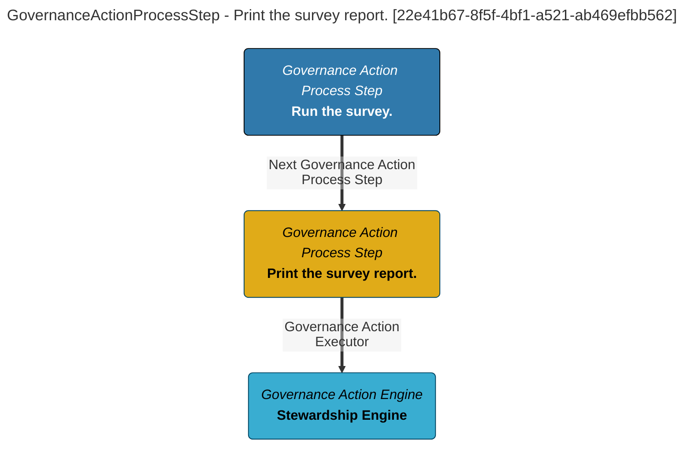

```mermaid
---
title: GovernanceActionProcessStep - Print the survey report. [22e41b67-8f5f-4bf1-a521-ab469efbb562]
---
flowchart TD
%%{init: {"flowchart": {"htmlLabels": false}} }%%

1@{ shape: rounded, label: "*Governance Action Process Step*
**Print the survey report.**"}
2@{ shape: rounded, label: "*Governance Action Process Step*
**Run the survey.**"}
2==>|"Next Governance Action Process Step"|1
3@{ shape: rounded, label: "*Governance Action Engine*
**Stewardship Engine**"}
1==>|"Governance Action Executor"|3
style 1 color:#000000, fill:#e0ab18, stroke:#004563
style 2 color:#FFFFFF, fill:#3079ab, stroke:#000000
style 3 color:#000000, fill:#39add1, stroke:#004563
```
