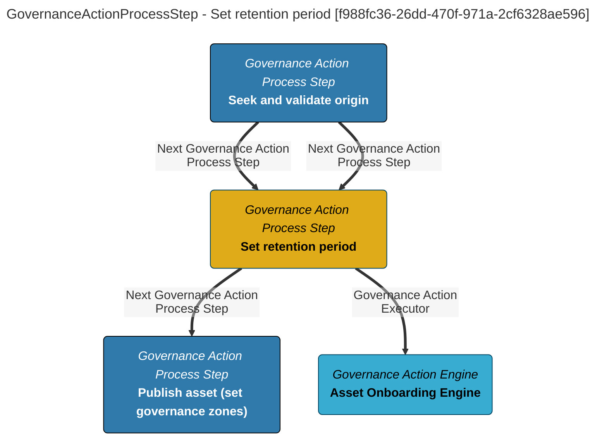

```mermaid
---
title: GovernanceActionProcessStep - Set retention period [f988fc36-26dd-470f-971a-2cf6328ae596]
---
flowchart TD
%%{init: {"flowchart": {"htmlLabels": false}} }%%

1@{ shape: rounded, label: "*Governance Action Process Step*
**Set retention period**"}
2@{ shape: rounded, label: "*Governance Action Process Step*
**Seek and validate origin**"}
2==>|"Next Governance Action Process Step"|1
2==>|"Next Governance Action Process Step"|1
3@{ shape: rounded, label: "*Governance Action Process Step*
**Publish asset (set governance zones)**"}
1==>|"Next Governance Action Process Step"|3
4@{ shape: rounded, label: "*Governance Action Engine*
**Asset Onboarding Engine**"}
1==>|"Governance Action Executor"|4
style 1 color:#000000, fill:#e0ab18, stroke:#004563
style 2 color:#FFFFFF, fill:#3079ab, stroke:#000000
style 3 color:#FFFFFF, fill:#3079ab, stroke:#000000
style 4 color:#000000, fill:#39add1, stroke:#004563
```
