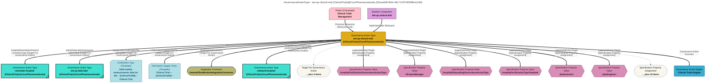

```mermaid
---
title: GovernanceActionType - set-up-clinical-trial (ClinicalTrials@CocoPharmaceuticals) [23ceab08-f644-49c7-b7f3-95f39fe41c84]
---
flowchart TD
%%{init: {"flowchart": {"htmlLabels": false}} }%%

1@{ shape: rounded, label: "*Governance Action Type*
**set-up-clinical-trial (ClinicalTrials@CocoPharmaceuticals)**"}
2@{ shape: notch-rect, label: "*Project [Campaign]*
**Clinical Trials Management**"}
2==>|"Provision Resource [Resource List]"|1
3@{ shape: tag-rect, label: "*Governance Action Type*
**nominate-hospital (ClinicalTrials@CocoPharmaceuticals)**"}
1==>|"hospitalNominationGovernanceActionType [Target For Governance Action]"|3
4@{ shape: tag-rect, label: "*Governance Action Type*
**set-up-data-lake (ClinicalTrials@CocoPharmaceuticals)**"}
1==>|"setUpDataLakeGovernanceActionType [Target For Governance Action]"|4
5@{ shape: card, label: "*Certification Type [Template]*
**Valid weekly measurements data for the ~ {clinicalTrialId} ~ Clinical Trial**"}
1==>|"dataQualityCertificationTypeTemplate [Target For Governance Action]"|5
6@{ shape: card, label: "*Information Supply Chain [Template]*
**Clinical Trial::~ {clinicalTrialId} ~**"}
1==>|"informationSupplyChainTemplate [Target For Governance Action]"|6
7@{ shape: stadium, label: "*Integration Connector*
**GeneralFilesMonitorIntegrationConnector**"}
1==>|"landingAreaConnector [Target For Governance Action]"|7
8@{ shape: tag-rect, label: "*Governance Action Type*
**onboard-hospital (ClinicalTrials@CocoPharmaceuticals)**"}
1==>|"hospitalOnboardingGovernanceActionType [Target For Governance Action]"|8
9@{ shape: stadium, label: "*Target For Governance Action*
**... plus 4 Items**"}
1-.->9
10@{ shape: hex, label: "*Specification Property Value*
**hospitalCertificationGovernanceActionType**"}
1==>|"supportedActionTarget [Specification Property Assignment]"|10
11@{ shape: hex, label: "*Specification Property Value*
**itProjectManager**"}
1==>|"supportedActionTarget [Specification Property Assignment]"|11
12@{ shape: hex, label: "*Specification Property Value*
**hospitalOnboardingGovernanceActionType**"}
1==>|"supportedActionTarget [Specification Property Assignment]"|12
13@{ shape: hex, label: "*Specification Property Value*
**hospitalCertificationTypeTemplate**"}
1==>|"supportedActionTarget [Specification Property Assignment]"|13
14@{ shape: hex, label: "*Specification Property Value*
**dataScientist**"}
1==>|"supportedActionTarget [Specification Property Assignment]"|14
15@{ shape: hex, label: "*Specification Property Value*
**dataEngineer**"}
1==>|"supportedActionTarget [Specification Property Assignment]"|15
16@{ shape: stadium, label: "*Specification Property Assignment*
**... plus 15 Items**"}
1-.->16
17@{ shape: rect, label: "*Solution Component*
**Set up clinical trial**"}
17==>|"Implementation Resource"|1
18@{ shape: rounded, label: "*Governance Action Engine*
**Clinical Trials Engine**"}
1==>|"Governance Action Executor"|18
style 11 color:#260d1b, fill:#d98cb6, stroke:#260d1b
style 12 color:#260d1b, fill:#d98cb6, stroke:#260d1b
style 13 color:#260d1b, fill:#d98cb6, stroke:#260d1b
style 14 color:#260d1b, fill:#d98cb6, stroke:#260d1b
style 15 color:#260d1b, fill:#d98cb6, stroke:#260d1b
style 16 color:#000000, fill:#F9F7ED, stroke:#b7c0c7
style 17 color:#000000, fill:#DDA0DD, stroke:#000000
style 18 color:#000000, fill:#39add1, stroke:#004563
style 1 color:#000000, fill:#e0ab18, stroke:#004563
style 2 color:#000000, fill:#FFC0CB, stroke:#000000
style 3 color:#000000, fill:#40E0D0, stroke:#000000
style 4 color:#000000, fill:#40E0D0, stroke:#000000
style 5 color:#004563, fill:#b0e0e6, stroke:#004563
style 6 color:#004563, fill:#b0e0e6, stroke:#004563
style 7 color:#000000, fill:#BDB76B, stroke:#004563
style 8 color:#000000, fill:#40E0D0, stroke:#000000
style 9 color:#000000, fill:#F9F7ED, stroke:#b7c0c7
style 10 color:#260d1b, fill:#d98cb6, stroke:#260d1b
```
