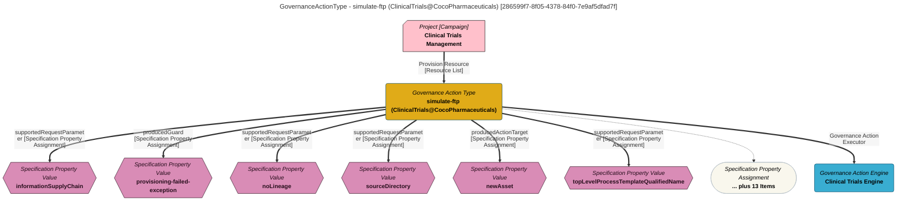

```mermaid
---
title: GovernanceActionType - simulate-ftp (ClinicalTrials@CocoPharmaceuticals) [286599f7-8f05-4378-84f0-7e9af5dfad7f]
---
flowchart TD
%%{init: {"flowchart": {"htmlLabels": false}} }%%

1@{ shape: rounded, label: "*Governance Action Type*
**simulate-ftp (ClinicalTrials@CocoPharmaceuticals)**"}
2@{ shape: notch-rect, label: "*Project [Campaign]*
**Clinical Trials Management**"}
2==>|"Provision Resource [Resource List]"|1
3@{ shape: hex, label: "*Specification Property Value*
**informationSupplyChain**"}
1==>|"supportedRequestParameter [Specification Property Assignment]"|3
4@{ shape: hex, label: "*Specification Property Value*
**provisioning-failed-exception**"}
1==>|"producedGuard [Specification Property Assignment]"|4
5@{ shape: hex, label: "*Specification Property Value*
**noLineage**"}
1==>|"supportedRequestParameter [Specification Property Assignment]"|5
6@{ shape: hex, label: "*Specification Property Value*
**sourceDirectory**"}
1==>|"supportedRequestParameter [Specification Property Assignment]"|6
7@{ shape: hex, label: "*Specification Property Value*
**newAsset**"}
1==>|"producedActionTarget [Specification Property Assignment]"|7
8@{ shape: hex, label: "*Specification Property Value*
**topLevelProcessTemplateQualifiedName**"}
1==>|"supportedRequestParameter [Specification Property Assignment]"|8
9@{ shape: stadium, label: "*Specification Property Assignment*
**... plus 13 Items**"}
1-.->9
10@{ shape: rounded, label: "*Governance Action Engine*
**Clinical Trials Engine**"}
1==>|"Governance Action Executor"|10
style 1 color:#000000, fill:#e0ab18, stroke:#004563
style 2 color:#000000, fill:#FFC0CB, stroke:#000000
style 3 color:#260d1b, fill:#d98cb6, stroke:#260d1b
style 4 color:#260d1b, fill:#d98cb6, stroke:#260d1b
style 5 color:#260d1b, fill:#d98cb6, stroke:#260d1b
style 6 color:#260d1b, fill:#d98cb6, stroke:#260d1b
style 7 color:#260d1b, fill:#d98cb6, stroke:#260d1b
style 8 color:#260d1b, fill:#d98cb6, stroke:#260d1b
style 9 color:#000000, fill:#F9F7ED, stroke:#b7c0c7
style 10 color:#000000, fill:#39add1, stroke:#004563
```
