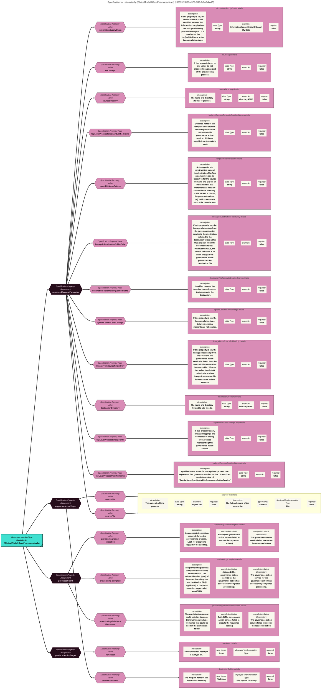

```mermaid
---
title: Specification for - simulate-ftp (ClinicalTrials@CocoPharmaceuticals) [286599f7-8f05-4378-84f0-7e9af5dfad7f]
---
flowchart LR
%%{init: {"flowchart": {"htmlLabels": false}} }%%

1@{ shape: tag-rect, label: "*Governance Action Type*
**simulate-ftp (ClinicalTrials@CocoPharmaceuticals)**"}
2@{ shape: hex, label: "*Specification Property Assignment*
**supportedRequestParameter**"}
1==>2
3@{ shape: hex, label: "*Specification Property Value*
**informationSupplyChain**"}
2==>3
subgraph 4 [informationSupplyChain details]
5@{ shape: text, label: "*description:*
**If this property is set, the value it is set to is the qualified name of the information supply chain that this provisioning process belongs to.  It is used to set the iscQualifiedName in the lineage relationships.**"}
6@{ shape: text, label: "*data Type:*
**string**"}
7@{ shape: text, label: "*example:*
**InformationSupplyChain:Onboard My Data**"}
8@{ shape: text, label: "*required:*
**false**"}
end
3==>4
9@{ shape: hex, label: "*Specification Property Value*
**noLineage**"}
2==>9
subgraph 10 [noLineage details]
11@{ shape: text, label: "*description:*
**If this property is set to any value, do not produce lineage as part of the provisioning process.**"}
12@{ shape: text, label: "*data Type:*
**string**"}
13@{ shape: text, label: "*example:*
"}
14@{ shape: text, label: "*required:*
**false**"}
end
9==>10
15@{ shape: hex, label: "*Specification Property Value*
**sourceDirectory**"}
2==>15
subgraph 16 [sourceDirectory details]
17@{ shape: text, label: "*description:*
**The name of a directory (folder) to process.**"}
18@{ shape: text, label: "*data Type:*
**string**"}
19@{ shape: text, label: "*example:*
**directoryA/B/C**"}
20@{ shape: text, label: "*required:*
**false**"}
end
15==>16
21@{ shape: hex, label: "*Specification Property Value*
**topLevelProcessTemplateQualifiedName**"}
2==>21
subgraph 22 [topLevelProcessTemplateQualifiedName details]
23@{ shape: text, label: "*description:*
**Qualified name of the template to use for the top level process that represents this governance action service.  If it is not specified, no template is used.**"}
24@{ shape: text, label: "*data Type:*
"}
25@{ shape: text, label: "*example:*
"}
26@{ shape: text, label: "*required:*
**false**"}
end
21==>22
27@{ shape: hex, label: "*Specification Property Value*
**targetFileNamePattern**"}
2==>27
subgraph 28 [targetFileNamePattern details]
29@{ shape: text, label: "*description:*
**A string pattern to construct the name of the destination file. Two placeholders can be used: 0 is for the source file name and 1 is for an index number that increments as files are created in the directory.  If this pattern is not set, the pattern defaults to ''{0}'' which means the source file name is used.**"}
30@{ shape: text, label: "*data Type:*
**string**"}
31@{ shape: text, label: "*example:*
"}
32@{ shape: text, label: "*required:*
**false**"}
end
27==>28
33@{ shape: hex, label: "*Specification Property Value*
**lineageToDestinationFolderOnly**"}
2==>33
subgraph 34 [lineageToDestinationFolderOnly details]
35@{ shape: text, label: "*description:*
**If this property is set, the lineage relationship from the governance action service to the destination is linked to the destination folder rather than the new file in the destination folder.  Without this value, the default behavior is to show lineage from governance action process to the destination file.**"}
36@{ shape: text, label: "*data Type:*
"}
37@{ shape: text, label: "*example:*
"}
38@{ shape: text, label: "*required:*
**false**"}
end
33==>34
39@{ shape: hex, label: "*Specification Property Value*
**destinationFileTemplateQualifiedName**"}
2==>39
subgraph 40 [destinationFileTemplateQualifiedName details]
41@{ shape: text, label: "*description:*
**Qualified name of the template to use for asset that represents the destination.**"}
42@{ shape: text, label: "*data Type:*
"}
43@{ shape: text, label: "*example:*
"}
44@{ shape: text, label: "*required:*
**false**"}
end
39==>40
45@{ shape: hex, label: "*Specification Property Value*
**sourceFile**"}
2==>45
subgraph 46 [sourceFile details]
47@{ shape: text, label: "*description:*
**The name of a file to process.**"}
48@{ shape: text, label: "*data Type:*
**string**"}
49@{ shape: text, label: "*example:*
**myFile.csv**"}
50@{ shape: text, label: "*required:*
**false**"}
end
45==>46
51@{ shape: hex, label: "*Specification Property Value*
**ignoreColumnLevelLineage**"}
2==>51
subgraph 52 [ignoreColumnLevelLineage details]
53@{ shape: text, label: "*description:*
**If this property is set, the lineage relationships between schema elements are not created.**"}
54@{ shape: text, label: "*data Type:*
"}
55@{ shape: text, label: "*example:*
"}
56@{ shape: text, label: "*required:*
**false**"}
end
51==>52
57@{ shape: hex, label: "*Specification Property Value*
**lineageFromSourceFolderOnly**"}
2==>57
subgraph 58 [lineageFromSourceFolderOnly details]
59@{ shape: text, label: "*description:*
**If this property is set, the lineage relationship from the source to the governance action service is linked from the source folder rather than the source file.  Without this value, the default behavior is to show lineage from source file to governance action process.**"}
60@{ shape: text, label: "*data Type:*
"}
61@{ shape: text, label: "*example:*
"}
62@{ shape: text, label: "*required:*
**false**"}
end
57==>58
63@{ shape: hex, label: "*Specification Property Value*
**destinationDirectory**"}
2==>63
subgraph 64 [destinationDirectory details]
65@{ shape: text, label: "*description:*
**The name of a directory (folder) to add files to.**"}
66@{ shape: text, label: "*data Type:*
**string**"}
67@{ shape: text, label: "*example:*
**directoryA/B/C**"}
68@{ shape: text, label: "*required:*
**false**"}
end
63==>64
69@{ shape: hex, label: "*Specification Property Value*
**topLevelProcessLineageOnly**"}
2==>69
subgraph 70 [topLevelProcessLineageOnly details]
71@{ shape: text, label: "*description:*
**If this property is set, lineage mappings are connected to the top level process representing this governance action service.**"}
72@{ shape: text, label: "*data Type:*
"}
73@{ shape: text, label: "*example:*
"}
74@{ shape: text, label: "*required:*
**false**"}
end
69==>70
75@{ shape: hex, label: "*Specification Property Value*
**topLevelProcessQualifiedName**"}
2==>75
subgraph 76 [topLevelProcessQualifiedName details]
77@{ shape: text, label: "*description:*
**Qualified name to use for the top level process that represents this governance action service.  It overrides the default value of ''Egeria:MoveCopyDeleteFileGovernanceActionService''.**"}
78@{ shape: text, label: "*data Type:*
**string**"}
79@{ shape: text, label: "*example:*
"}
80@{ shape: text, label: "*required:*
**false**"}
end
75==>76
81@{ shape: hex, label: "*Specification Property Assignment*
**producedGuard**"}
1==>81
82@{ shape: hex, label: "*Specification Property Value*
**provisioning-failed-exception**"}
81==>82
subgraph 83 [provisioning-failed-exception details]
84@{ shape: text, label: "*description:*
**An unexpected exception occurred during the provisioning process.  Look for exceptions logged in the audit log.**"}
85@{ shape: text, label: "*completion Status:*
**Failed (The governance action service failed to execute the requested action.)**"}
86@{ shape: text, label: "*completion Status Description:*
**The governance action service failed to execute the requested action.**"}
end
82==>83
87@{ shape: hex, label: "*Specification Property Value*
**provisioning-complete**"}
81==>87
subgraph 88 [provisioning-complete details]
89@{ shape: text, label: "*description:*
**The provisioning request completed successfully with no errors.  The unique identifier (guid) of the asset describing the new destination file (if applicable) is output as an action target called assetGUID.**"}
90@{ shape: text, label: "*completion Status:*
**Actioned (The governance action service for the governance action has successfully completed processing.)**"}
91@{ shape: text, label: "*completion Status Description:*
**The governance action service for the governance action has successfully completed processing.**"}
end
87==>88
92@{ shape: hex, label: "*Specification Property Value*
**provisioning-failed-no-file-names**"}
81==>92
subgraph 93 [provisioning-failed-no-file-names details]
94@{ shape: text, label: "*description:*
**The provisioning request could not start because there were no available file names that could be used in the destination folder.**"}
95@{ shape: text, label: "*completion Status:*
**Failed (The governance action service failed to execute the requested action.)**"}
96@{ shape: text, label: "*completion Status Description:*
**The governance action service failed to execute the requested action.**"}
end
92==>93
97@{ shape: hex, label: "*Specification Property Assignment*
**producedActionTarget**"}
1==>97
98@{ shape: hex, label: "*Specification Property Value*
**newAsset**"}
97==>98
subgraph 99 [newAsset details]
100@{ shape: text, label: "*description:*
**A newly created Asset (or a subtype of).**"}
101@{ shape: text, label: "*type Name:*
**Asset**"}
102@{ shape: text, label: "*deployed Implementation Type:*
"}
103@{ shape: text, label: "*required:*
**false**"}
end
98==>99
104@{ shape: hex, label: "*Specification Property Assignment*
**supportedActionTarget**"}
1==>104
105@{ shape: hex, label: "*Specification Property Value*
**destinationFolder**"}
104==>105
subgraph 106 [destinationFolder details]
107@{ shape: text, label: "*description:*
**The full path name of the destination directory.**"}
108@{ shape: text, label: "*type Name:*
**FileFolder**"}
109@{ shape: text, label: "*deployed Implementation Type:*
**File System Directory**"}
110@{ shape: text, label: "*required:*
**false**"}
end
105==>106
111@{ shape: hex, label: "*Specification Property Value*
**sourceFile**"}
104==>111
subgraph 46 [sourceFile details]
112@{ shape: text, label: "*description:*
**The full path name of the source file.**"}
113@{ shape: text, label: "*type Name:*
**DataFile**"}
114@{ shape: text, label: "*deployed Implementation Type:*
**File**"}
115@{ shape: text, label: "*required:*
**false**"}
end
111==>46
style 88 color:#260d1b, fill:#d98cb6, stroke:#260d1b
style 89 color:#000000, fill:#F9F7ED, stroke:#b7c0c7
style 110 color:#000000, fill:#F9F7ED, stroke:#b7c0c7
style 111 color:#260d1b, fill:#d98cb6, stroke:#260d1b
style 112 color:#000000, fill:#F9F7ED, stroke:#b7c0c7
style 113 color:#000000, fill:#F9F7ED, stroke:#b7c0c7
style 114 color:#000000, fill:#F9F7ED, stroke:#b7c0c7
style 115 color:#000000, fill:#F9F7ED, stroke:#b7c0c7
style 90 color:#000000, fill:#F9F7ED, stroke:#b7c0c7
style 91 color:#000000, fill:#F9F7ED, stroke:#b7c0c7
style 92 color:#260d1b, fill:#d98cb6, stroke:#260d1b
style 93 color:#260d1b, fill:#d98cb6, stroke:#260d1b
style 94 color:#000000, fill:#F9F7ED, stroke:#b7c0c7
style 95 color:#000000, fill:#F9F7ED, stroke:#b7c0c7
style 96 color:#000000, fill:#F9F7ED, stroke:#b7c0c7
style 97 color:#f2d9e7, fill:#260d1b, stroke:#f2d9e7
style 10 color:#260d1b, fill:#d98cb6, stroke:#260d1b
style 98 color:#260d1b, fill:#d98cb6, stroke:#260d1b
style 11 color:#000000, fill:#F9F7ED, stroke:#b7c0c7
style 99 color:#260d1b, fill:#d98cb6, stroke:#260d1b
style 12 color:#000000, fill:#F9F7ED, stroke:#b7c0c7
style 13 color:#000000, fill:#F9F7ED, stroke:#b7c0c7
style 14 color:#000000, fill:#F9F7ED, stroke:#b7c0c7
style 15 color:#260d1b, fill:#d98cb6, stroke:#260d1b
style 16 color:#260d1b, fill:#d98cb6, stroke:#260d1b
style 17 color:#000000, fill:#F9F7ED, stroke:#b7c0c7
style 18 color:#000000, fill:#F9F7ED, stroke:#b7c0c7
style 19 color:#000000, fill:#F9F7ED, stroke:#b7c0c7
style 1 color:#000000, fill:#40E0D0, stroke:#000000
style 2 color:#f2d9e7, fill:#260d1b, stroke:#f2d9e7
style 3 color:#260d1b, fill:#d98cb6, stroke:#260d1b
style 4 color:#260d1b, fill:#d98cb6, stroke:#260d1b
style 5 color:#000000, fill:#F9F7ED, stroke:#b7c0c7
style 6 color:#000000, fill:#F9F7ED, stroke:#b7c0c7
style 7 color:#000000, fill:#F9F7ED, stroke:#b7c0c7
style 8 color:#000000, fill:#F9F7ED, stroke:#b7c0c7
style 9 color:#260d1b, fill:#d98cb6, stroke:#260d1b
style 20 color:#000000, fill:#F9F7ED, stroke:#b7c0c7
style 21 color:#260d1b, fill:#d98cb6, stroke:#260d1b
style 22 color:#260d1b, fill:#d98cb6, stroke:#260d1b
style 23 color:#000000, fill:#F9F7ED, stroke:#b7c0c7
style 24 color:#000000, fill:#F9F7ED, stroke:#b7c0c7
style 25 color:#000000, fill:#F9F7ED, stroke:#b7c0c7
style 26 color:#000000, fill:#F9F7ED, stroke:#b7c0c7
style 27 color:#260d1b, fill:#d98cb6, stroke:#260d1b
style 28 color:#260d1b, fill:#d98cb6, stroke:#260d1b
style 29 color:#000000, fill:#F9F7ED, stroke:#b7c0c7
style 30 color:#000000, fill:#F9F7ED, stroke:#b7c0c7
style 31 color:#000000, fill:#F9F7ED, stroke:#b7c0c7
style 32 color:#000000, fill:#F9F7ED, stroke:#b7c0c7
style 33 color:#260d1b, fill:#d98cb6, stroke:#260d1b
style 34 color:#260d1b, fill:#d98cb6, stroke:#260d1b
style 35 color:#000000, fill:#F9F7ED, stroke:#b7c0c7
style 36 color:#000000, fill:#F9F7ED, stroke:#b7c0c7
style 37 color:#000000, fill:#F9F7ED, stroke:#b7c0c7
style 38 color:#000000, fill:#F9F7ED, stroke:#b7c0c7
style 39 color:#260d1b, fill:#d98cb6, stroke:#260d1b
style 40 color:#260d1b, fill:#d98cb6, stroke:#260d1b
style 41 color:#000000, fill:#F9F7ED, stroke:#b7c0c7
style 42 color:#000000, fill:#F9F7ED, stroke:#b7c0c7
style 43 color:#000000, fill:#F9F7ED, stroke:#b7c0c7
style 44 color:#000000, fill:#F9F7ED, stroke:#b7c0c7
style 45 color:#260d1b, fill:#d98cb6, stroke:#260d1b
style 46 color:#260d1b, fill:#d98cb6, stroke:#260d1b
style 47 color:#000000, fill:#F9F7ED, stroke:#b7c0c7
style 48 color:#000000, fill:#F9F7ED, stroke:#b7c0c7
style 49 color:#000000, fill:#F9F7ED, stroke:#b7c0c7
style 50 color:#000000, fill:#F9F7ED, stroke:#b7c0c7
style 51 color:#260d1b, fill:#d98cb6, stroke:#260d1b
style 52 color:#260d1b, fill:#d98cb6, stroke:#260d1b
style 53 color:#000000, fill:#F9F7ED, stroke:#b7c0c7
style 54 color:#000000, fill:#F9F7ED, stroke:#b7c0c7
style 55 color:#000000, fill:#F9F7ED, stroke:#b7c0c7
style 56 color:#000000, fill:#F9F7ED, stroke:#b7c0c7
style 57 color:#260d1b, fill:#d98cb6, stroke:#260d1b
style 58 color:#260d1b, fill:#d98cb6, stroke:#260d1b
style 59 color:#000000, fill:#F9F7ED, stroke:#b7c0c7
style 60 color:#000000, fill:#F9F7ED, stroke:#b7c0c7
style 61 color:#000000, fill:#F9F7ED, stroke:#b7c0c7
style 62 color:#000000, fill:#F9F7ED, stroke:#b7c0c7
style 63 color:#260d1b, fill:#d98cb6, stroke:#260d1b
style 64 color:#260d1b, fill:#d98cb6, stroke:#260d1b
style 65 color:#000000, fill:#F9F7ED, stroke:#b7c0c7
style 66 color:#000000, fill:#F9F7ED, stroke:#b7c0c7
style 67 color:#000000, fill:#F9F7ED, stroke:#b7c0c7
style 68 color:#000000, fill:#F9F7ED, stroke:#b7c0c7
style 69 color:#260d1b, fill:#d98cb6, stroke:#260d1b
style 70 color:#260d1b, fill:#d98cb6, stroke:#260d1b
style 71 color:#000000, fill:#F9F7ED, stroke:#b7c0c7
style 72 color:#000000, fill:#F9F7ED, stroke:#b7c0c7
style 73 color:#000000, fill:#F9F7ED, stroke:#b7c0c7
style 74 color:#000000, fill:#F9F7ED, stroke:#b7c0c7
style 75 color:#260d1b, fill:#d98cb6, stroke:#260d1b
style 76 color:#260d1b, fill:#d98cb6, stroke:#260d1b
style 77 color:#000000, fill:#F9F7ED, stroke:#b7c0c7
style 78 color:#000000, fill:#F9F7ED, stroke:#b7c0c7
style 79 color:#000000, fill:#F9F7ED, stroke:#b7c0c7
style 100 color:#000000, fill:#F9F7ED, stroke:#b7c0c7
style 101 color:#000000, fill:#F9F7ED, stroke:#b7c0c7
style 102 color:#000000, fill:#F9F7ED, stroke:#b7c0c7
style 103 color:#000000, fill:#F9F7ED, stroke:#b7c0c7
style 104 color:#f2d9e7, fill:#260d1b, stroke:#f2d9e7
style 105 color:#260d1b, fill:#d98cb6, stroke:#260d1b
style 106 color:#260d1b, fill:#d98cb6, stroke:#260d1b
style 80 color:#000000, fill:#F9F7ED, stroke:#b7c0c7
style 107 color:#000000, fill:#F9F7ED, stroke:#b7c0c7
style 81 color:#f2d9e7, fill:#260d1b, stroke:#f2d9e7
style 108 color:#000000, fill:#F9F7ED, stroke:#b7c0c7
style 82 color:#260d1b, fill:#d98cb6, stroke:#260d1b
style 109 color:#000000, fill:#F9F7ED, stroke:#b7c0c7
style 83 color:#260d1b, fill:#d98cb6, stroke:#260d1b
style 84 color:#000000, fill:#F9F7ED, stroke:#b7c0c7
style 85 color:#000000, fill:#F9F7ED, stroke:#b7c0c7
style 86 color:#000000, fill:#F9F7ED, stroke:#b7c0c7
style 87 color:#260d1b, fill:#d98cb6, stroke:#260d1b
```
