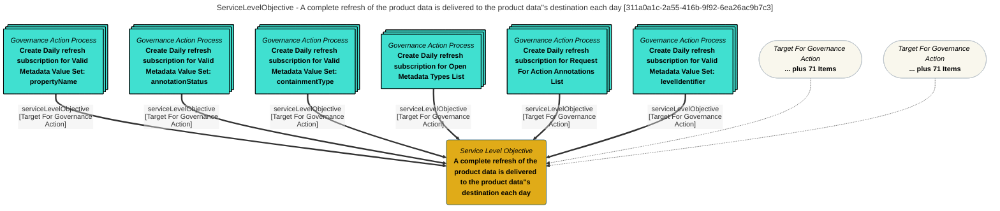

```mermaid
---
title: ServiceLevelObjective - A complete refresh of the product data is delivered to the product data''s destination each day [311a0a1c-2a55-416b-9f92-6ea26ac9b7c3]
---
flowchart TD
%%{init: {"flowchart": {"htmlLabels": false}} }%%

1@{ shape: rounded, label: "*Service Level Objective*
**A complete refresh of the product data is delivered to the product data''s destination each day**"}
2@{ shape: processes, label: "*Governance Action Process*
**Create Daily refresh subscription for Valid Metadata Value Set: propertyName**"}
2==>|"serviceLevelObjective [Target For Governance Action]"|1
3@{ shape: processes, label: "*Governance Action Process*
**Create Daily refresh subscription for Valid Metadata Value Set: annotationStatus**"}
3==>|"serviceLevelObjective [Target For Governance Action]"|1
4@{ shape: processes, label: "*Governance Action Process*
**Create Daily refresh subscription for Valid Metadata Value Set: containmentType**"}
4==>|"serviceLevelObjective [Target For Governance Action]"|1
5@{ shape: processes, label: "*Governance Action Process*
**Create Daily refresh subscription for Open Metadata Types List**"}
5==>|"serviceLevelObjective [Target For Governance Action]"|1
6@{ shape: processes, label: "*Governance Action Process*
**Create Daily refresh subscription for Request For Action Annotations List**"}
6==>|"serviceLevelObjective [Target For Governance Action]"|1
7@{ shape: processes, label: "*Governance Action Process*
**Create Daily refresh subscription for Valid Metadata Value Set: levelIdentifier**"}
7==>|"serviceLevelObjective [Target For Governance Action]"|1
8@{ shape: stadium, label: "*Target For Governance Action*
**... plus 71 Items**"}
8-.->1
9@{ shape: stadium, label: "*Target For Governance Action*
**... plus 71 Items**"}
9-.->1
style 1 color:#000000, fill:#e0ab18, stroke:#004563
style 2 color:#000000, fill:#40E0D0, stroke:#000000
style 3 color:#000000, fill:#40E0D0, stroke:#000000
style 4 color:#000000, fill:#40E0D0, stroke:#000000
style 5 color:#000000, fill:#40E0D0, stroke:#000000
style 6 color:#000000, fill:#40E0D0, stroke:#000000
style 7 color:#000000, fill:#40E0D0, stroke:#000000
style 8 color:#000000, fill:#F9F7ED, stroke:#b7c0c7
style 9 color:#000000, fill:#F9F7ED, stroke:#b7c0c7
```
