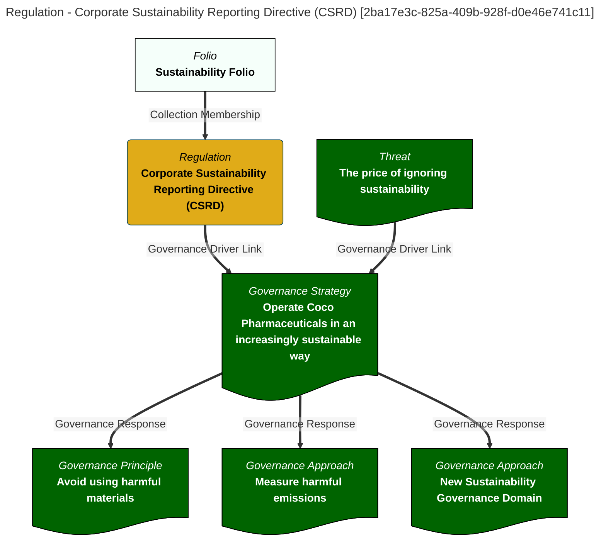

```mermaid
---
title: Regulation - Corporate Sustainability Reporting Directive (CSRD) [2ba17e3c-825a-409b-928f-d0e46e741c11]
---
flowchart TD
%%{init: {"flowchart": {"htmlLabels": false}} }%%

1@{ shape: rounded, label: "*Regulation*
**Corporate Sustainability Reporting Directive (CSRD)**"}
2@{ shape: rect, label: "*Folio*
**Sustainability Folio**"}
2==>|"Collection Membership"|1
3@{ shape: doc, label: "*Governance Strategy*
**Operate Coco Pharmaceuticals in an increasingly sustainable way**"}
1==>|"Governance Driver Link"|3
4@{ shape: doc, label: "*Governance Principle*
**Avoid using harmful materials**"}
3==>|"Governance Response"|4
5@{ shape: doc, label: "*Governance Approach*
**Measure harmful emissions**"}
3==>|"Governance Response"|5
6@{ shape: doc, label: "*Governance Approach*
**New Sustainability Governance Domain**"}
3==>|"Governance Response"|6
7@{ shape: doc, label: "*Threat*
**The price of ignoring sustainability**"}
7==>|"Governance Driver Link"|3
style 1 color:#000000, fill:#e0ab18, stroke:#004563
style 2 color:#000000, fill:#f5fffa, stroke:#000000
style 3 color:#FFFFFF, fill:#006400, stroke:#000000
style 4 color:#FFFFFF, fill:#006400, stroke:#000000
style 5 color:#FFFFFF, fill:#006400, stroke:#000000
style 6 color:#FFFFFF, fill:#006400, stroke:#000000
style 7 color:#FFFFFF, fill:#006400, stroke:#000000
```
