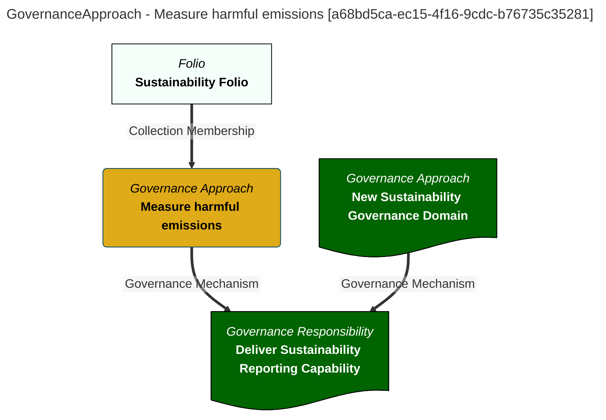

```mermaid
---
title: GovernanceApproach - Measure harmful emissions [a68bd5ca-ec15-4f16-9cdc-b76735c35281]
---
flowchart TD
%%{init: {"flowchart": {"htmlLabels": false}} }%%

1@{ shape: rounded, label: "*Governance Approach*
**Measure harmful emissions**"}
2@{ shape: rect, label: "*Folio*
**Sustainability Folio**"}
2==>|"Collection Membership"|1
3@{ shape: doc, label: "*Governance Responsibility*
**Deliver Sustainability Reporting Capability**"}
1==>|"Governance Mechanism"|3
4@{ shape: doc, label: "*Governance Approach*
**New Sustainability Governance Domain**"}
4==>|"Governance Mechanism"|3
style 1 color:#000000, fill:#e0ab18, stroke:#004563
style 2 color:#000000, fill:#f5fffa, stroke:#000000
style 3 color:#FFFFFF, fill:#006400, stroke:#000000
style 4 color:#FFFFFF, fill:#006400, stroke:#000000
```
