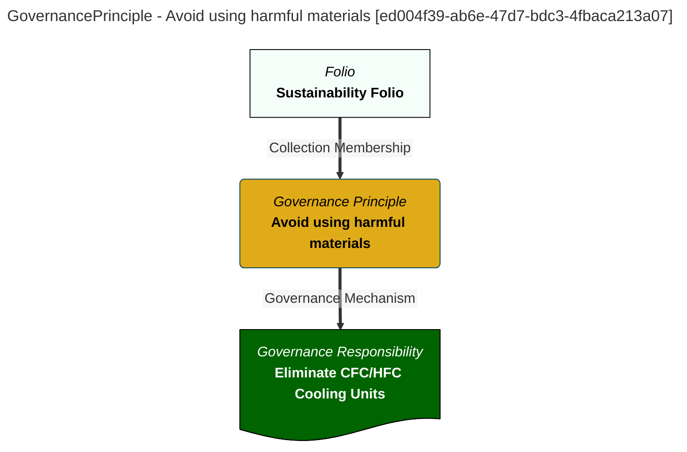

```mermaid
---
title: GovernancePrinciple - Avoid using harmful materials [ed004f39-ab6e-47d7-bdc3-4fbaca213a07]
---
flowchart TD
%%{init: {"flowchart": {"htmlLabels": false}} }%%

1@{ shape: rounded, label: "*Governance Principle*
**Avoid using harmful materials**"}
2@{ shape: rect, label: "*Folio*
**Sustainability Folio**"}
2==>|"Collection Membership"|1
3@{ shape: doc, label: "*Governance Responsibility*
**Eliminate CFC/HFC Cooling Units**"}
1==>|"Governance Mechanism"|3
style 1 color:#000000, fill:#e0ab18, stroke:#004563
style 2 color:#000000, fill:#f5fffa, stroke:#000000
style 3 color:#FFFFFF, fill:#006400, stroke:#000000
```
