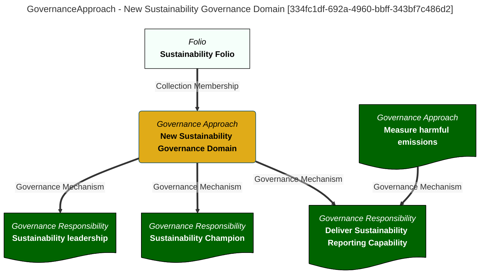

```mermaid
---
title: GovernanceApproach - New Sustainability Governance Domain [334fc1df-692a-4960-bbff-343bf7c486d2]
---
flowchart TD
%%{init: {"flowchart": {"htmlLabels": false}} }%%

1@{ shape: rounded, label: "*Governance Approach*
**New Sustainability Governance Domain**"}
2@{ shape: rect, label: "*Folio*
**Sustainability Folio**"}
2==>|"Collection Membership"|1
3@{ shape: doc, label: "*Governance Responsibility*
**Sustainability leadership**"}
1==>|"Governance Mechanism"|3
4@{ shape: doc, label: "*Governance Responsibility*
**Sustainability Champion**"}
1==>|"Governance Mechanism"|4
5@{ shape: doc, label: "*Governance Responsibility*
**Deliver Sustainability Reporting Capability**"}
1==>|"Governance Mechanism"|5
6@{ shape: doc, label: "*Governance Approach*
**Measure harmful emissions**"}
6==>|"Governance Mechanism"|5
style 1 color:#000000, fill:#e0ab18, stroke:#004563
style 2 color:#000000, fill:#f5fffa, stroke:#000000
style 3 color:#FFFFFF, fill:#006400, stroke:#000000
style 4 color:#FFFFFF, fill:#006400, stroke:#000000
style 5 color:#FFFFFF, fill:#006400, stroke:#000000
style 6 color:#FFFFFF, fill:#006400, stroke:#000000
```
