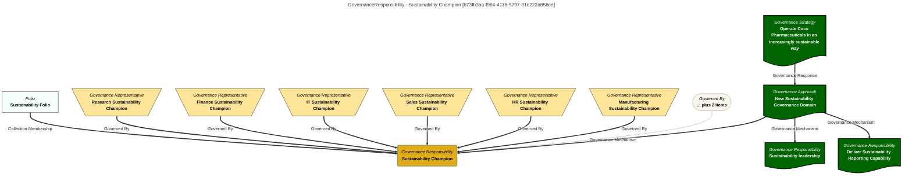

```mermaid
---
title: GovernanceResponsibility - Sustainability Champion [b73fb3aa-f964-4118-9797-81e222a858ce]
---
flowchart TD
%%{init: {"flowchart": {"htmlLabels": false}} }%%

1@{ shape: rounded, label: "*Governance Responsibility*
**Sustainability Champion**"}
2@{ shape: rect, label: "*Folio*
**Sustainability Folio**"}
2==>|"Collection Membership"|1
3@{ shape: trap-t, label: "*Governance Representative*
**Research Sustainability Champion**"}
3==>|"Governed By"|1
4@{ shape: trap-t, label: "*Governance Representative*
**Finance Sustainability Champion**"}
4==>|"Governed By"|1
5@{ shape: trap-t, label: "*Governance Representative*
**IT Sustainability Champion**"}
5==>|"Governed By"|1
6@{ shape: trap-t, label: "*Governance Representative*
**Sales Sustainability Champion**"}
6==>|"Governed By"|1
7@{ shape: trap-t, label: "*Governance Representative*
**HR Sustainability Champion**"}
7==>|"Governed By"|1
8@{ shape: trap-t, label: "*Governance Representative*
**Manufacturing Sustainability Champion**"}
8==>|"Governed By"|1
9@{ shape: stadium, label: "*Governed By*
**... plus 2 Items**"}
9-.->1
10@{ shape: doc, label: "*Governance Approach*
**New Sustainability Governance Domain**"}
10==>|"Governance Mechanism"|1
11@{ shape: doc, label: "*Governance Strategy*
**Operate Coco Pharmaceuticals in an increasingly sustainable way**"}
11==>|"Governance Response"|10
12@{ shape: doc, label: "*Governance Responsibility*
**Sustainability leadership**"}
10==>|"Governance Mechanism"|12
13@{ shape: doc, label: "*Governance Responsibility*
**Deliver Sustainability Reporting Capability**"}
10==>|"Governance Mechanism"|13
style 11 color:#FFFFFF, fill:#006400, stroke:#000000
style 12 color:#FFFFFF, fill:#006400, stroke:#000000
style 13 color:#FFFFFF, fill:#006400, stroke:#000000
style 1 color:#000000, fill:#e0ab18, stroke:#004563
style 2 color:#000000, fill:#f5fffa, stroke:#000000
style 3 color:#000000, fill:#FFE599, stroke:#000000
style 4 color:#000000, fill:#FFE599, stroke:#000000
style 5 color:#000000, fill:#FFE599, stroke:#000000
style 6 color:#000000, fill:#FFE599, stroke:#000000
style 7 color:#000000, fill:#FFE599, stroke:#000000
style 8 color:#000000, fill:#FFE599, stroke:#000000
style 9 color:#000000, fill:#F9F7ED, stroke:#b7c0c7
style 10 color:#FFFFFF, fill:#006400, stroke:#000000
```
