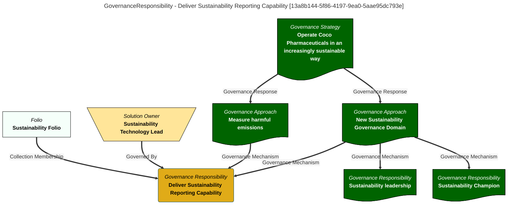

```mermaid
---
title: GovernanceResponsibility - Deliver Sustainability Reporting Capability [13a8b144-5f86-4197-9ea0-5aae95dc793e]
---
flowchart TD
%%{init: {"flowchart": {"htmlLabels": false}} }%%

1@{ shape: rounded, label: "*Governance Responsibility*
**Deliver Sustainability Reporting Capability**"}
2@{ shape: rect, label: "*Folio*
**Sustainability Folio**"}
2==>|"Collection Membership"|1
3@{ shape: trap-t, label: "*Solution Owner*
**Sustainability Technology Lead**"}
3==>|"Governed By"|1
4@{ shape: doc, label: "*Governance Approach*
**Measure harmful emissions**"}
4==>|"Governance Mechanism"|1
5@{ shape: doc, label: "*Governance Strategy*
**Operate Coco Pharmaceuticals in an increasingly sustainable way**"}
5==>|"Governance Response"|4
6@{ shape: doc, label: "*Governance Approach*
**New Sustainability Governance Domain**"}
6==>|"Governance Mechanism"|1
5==>|"Governance Response"|6
7@{ shape: doc, label: "*Governance Responsibility*
**Sustainability leadership**"}
6==>|"Governance Mechanism"|7
8@{ shape: doc, label: "*Governance Responsibility*
**Sustainability Champion**"}
6==>|"Governance Mechanism"|8
style 1 color:#000000, fill:#e0ab18, stroke:#004563
style 2 color:#000000, fill:#f5fffa, stroke:#000000
style 3 color:#000000, fill:#FFE599, stroke:#000000
style 4 color:#FFFFFF, fill:#006400, stroke:#000000
style 5 color:#FFFFFF, fill:#006400, stroke:#000000
style 6 color:#FFFFFF, fill:#006400, stroke:#000000
style 7 color:#FFFFFF, fill:#006400, stroke:#000000
style 8 color:#FFFFFF, fill:#006400, stroke:#000000
```
