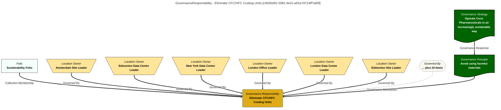

```mermaid
---
title: GovernanceResponsibility - Eliminate CFC/HFC Cooling Units [c4635d92-2082-4e01-a92a-f3714ff7a65f]
---
flowchart TD
%%{init: {"flowchart": {"htmlLabels": false}} }%%

1@{ shape: rounded, label: "*Governance Responsibility*
**Eliminate CFC/HFC Cooling Units**"}
2@{ shape: rect, label: "*Folio*
**Sustainability Folio**"}
2==>|"Collection Membership"|1
3@{ shape: trap-t, label: "*Location Owner*
**Amsterdam Site Leader**"}
3==>|"Governed By"|1
4@{ shape: trap-t, label: "*Location Owner*
**Edmonton Data Centre Leader**"}
4==>|"Governed By"|1
5@{ shape: trap-t, label: "*Location Owner*
**New York Data Center Leader**"}
5==>|"Governed By"|1
6@{ shape: trap-t, label: "*Location Owner*
**London Office Leader**"}
6==>|"Governed By"|1
7@{ shape: trap-t, label: "*Location Owner*
**London Data Center Leader**"}
7==>|"Governed By"|1
8@{ shape: trap-t, label: "*Location Owner*
**Edmonton Site Leader**"}
8==>|"Governed By"|1
9@{ shape: stadium, label: "*Governed By*
**... plus 24 Items**"}
9-.->1
10@{ shape: doc, label: "*Governance Principle*
**Avoid using harmful materials**"}
10==>|"Governance Mechanism"|1
11@{ shape: doc, label: "*Governance Strategy*
**Operate Coco Pharmaceuticals in an increasingly sustainable way**"}
11==>|"Governance Response"|10
style 11 color:#FFFFFF, fill:#006400, stroke:#000000
style 1 color:#000000, fill:#e0ab18, stroke:#004563
style 2 color:#000000, fill:#f5fffa, stroke:#000000
style 3 color:#000000, fill:#FFE599, stroke:#000000
style 4 color:#000000, fill:#FFE599, stroke:#000000
style 5 color:#000000, fill:#FFE599, stroke:#000000
style 6 color:#000000, fill:#FFE599, stroke:#000000
style 7 color:#000000, fill:#FFE599, stroke:#000000
style 8 color:#000000, fill:#FFE599, stroke:#000000
style 9 color:#000000, fill:#F9F7ED, stroke:#b7c0c7
style 10 color:#FFFFFF, fill:#006400, stroke:#000000
```
