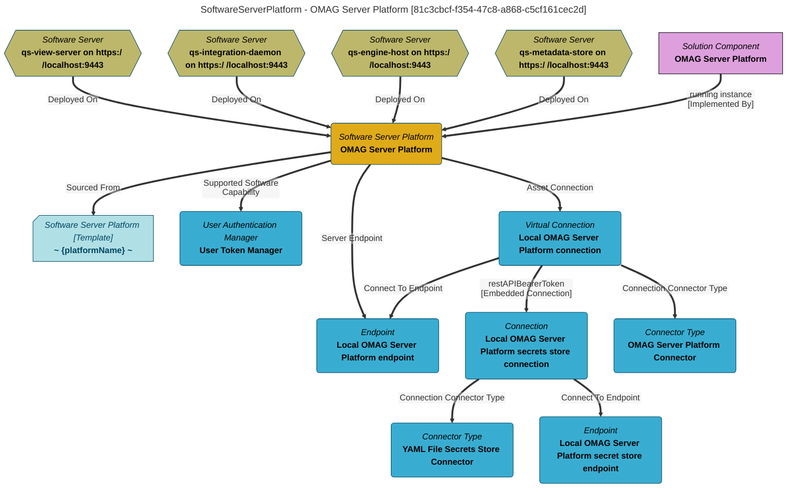

```mermaid
---
title: SoftwareServerPlatform - OMAG Server Platform [81c3cbcf-f354-47c8-a868-c5cf161cec2d]
---
flowchart TD
%%{init: {"flowchart": {"htmlLabels": false}} }%%

1@{ shape: rounded, label: "*Software Server Platform*
**OMAG Server Platform**"}
2@{ shape: card, label: "*Software Server Platform [Template]*
**~ {platformName} ~**"}
1==>|"Sourced From"|2
3@{ shape: rounded, label: "*Endpoint*
**Local OMAG Server Platform endpoint**"}
1==>|"Server Endpoint"|3
4@{ shape: hex, label: "*Software Server*
**qs-view-server on https:/ /localhost:9443**"}
4==>|"Deployed On"|1
5@{ shape: hex, label: "*Software Server*
**qs-integration-daemon on https:/ /localhost:9443**"}
5==>|"Deployed On"|1
6@{ shape: hex, label: "*Software Server*
**qs-engine-host on https:/ /localhost:9443**"}
6==>|"Deployed On"|1
7@{ shape: hex, label: "*Software Server*
**qs-metadata-store on https:/ /localhost:9443**"}
7==>|"Deployed On"|1
8@{ shape: rounded, label: "*User Authentication Manager*
**User Token Manager**"}
1==>|"Supported Software Capability"|8
9@{ shape: rounded, label: "*Virtual Connection*
**Local OMAG Server Platform connection**"}
1==>|"Asset Connection"|9
10@{ shape: rounded, label: "*Connection*
**Local OMAG Server Platform secrets store connection**"}
9==>|"restAPIBearerToken [Embedded Connection]"|10
11@{ shape: rounded, label: "*Connector Type*
**YAML File Secrets Store Connector**"}
10==>|"Connection Connector Type"|11
12@{ shape: rounded, label: "*Endpoint*
**Local OMAG Server Platform secret store endpoint**"}
10==>|"Connect To Endpoint"|12
13@{ shape: rounded, label: "*Connector Type*
**OMAG Server Platform Connector**"}
9==>|"Connection Connector Type"|13
9==>|"Connect To Endpoint"|3
14@{ shape: rect, label: "*Solution Component*
**OMAG Server Platform**"}
14==>|"running instance [Implemented By]"|1
style 11 color:#000000, fill:#39add1, stroke:#004563
style 12 color:#000000, fill:#39add1, stroke:#004563
style 13 color:#000000, fill:#39add1, stroke:#004563
style 14 color:#000000, fill:#DDA0DD, stroke:#000000
style 1 color:#000000, fill:#e0ab18, stroke:#004563
style 2 color:#004563, fill:#b0e0e6, stroke:#004563
style 3 color:#000000, fill:#39add1, stroke:#004563
style 4 color:#000000, fill:#BDB76B, stroke:#004563
style 5 color:#000000, fill:#BDB76B, stroke:#004563
style 6 color:#000000, fill:#BDB76B, stroke:#004563
style 7 color:#000000, fill:#BDB76B, stroke:#004563
style 8 color:#000000, fill:#39add1, stroke:#004563
style 9 color:#000000, fill:#39add1, stroke:#004563
style 10 color:#000000, fill:#39add1, stroke:#004563
click 1 "https://egeria-project.org/concepts/omag-server-platform/" "Click for more documentation" _blank
click 14 "https://egeria-project.org/concepts/omag-server-platform/" "Click for more documentation" _blank
click 4 "https://egeria-project.org/concepts/view-server/" "Click for more documentation" _blank
click 5 "https://egeria-project.org/concepts/integration-daemon/" "Click for more documentation" _blank
click 6 "https://egeria-project.org/concepts/engine-host/" "Click for more documentation" _blank
click 7 "https://egeria-project.org/concepts/metadata-access-store/" "Click for more documentation" _blank
```
> OMAG Server Platform: Egeria services that provide metadata, context and insight interoperability between people, tools and platforms. (Extracted from 6.0-SNAPSHOT)
