```mermaid
---
title: SoftwareServer - qs-integration-daemon on https://localhost:9443 [1beff5ee-7322-4d40-b2c3-d308f6d0c806]
---
flowchart TD
%%{init: {"flowchart": {"htmlLabels": false}} }%%

1@{ shape: rounded, label: "*Software Server*
**qs-integration-daemon on https:/ /localhost:9443**"}
2@{ shape: card, label: "*Software Server [Template]*
**~ {serverName} ~**"}
1==>|"Sourced From"|2
3@{ shape: rounded, label: "*Endpoint*
**qs-integration-daemon endpoint**"}
1==>|"Server Endpoint"|3
4@{ shape: hex, label: "*Software Server Platform*
**OMAG Server Platform**"}
1==>|"Deployed On"|4
5@{ shape: rounded, label: "*Integration Group*
**PostgreSQLIntegrationGroup**"}
1==>|"Supported Software Capability"|5
6@{ shape: rounded, label: "*Integration Group*
**EgeriaIntegrationGroup**"}
1==>|"Supported Software Capability"|6
7@{ shape: rounded, label: "*Integration Group*
**DefaultIntegrationGroup**"}
1==>|"Supported Software Capability"|7
8@{ shape: rounded, label: "*A P I Manager*
**Integration Connector Status APIs**"}
1==>|"Supported Software Capability"|8
9@{ shape: rounded, label: "*Integration Group*
**JacquardIntegrationGroup**"}
1==>|"Supported Software Capability"|9
10@{ shape: rounded, label: "*Integration Group*
**FilesIntegrationGroup**"}
1==>|"Supported Software Capability"|10
11@{ shape: stadium, label: "*Supported Software Capability*
**... plus 6 Items**"}
1-.->11
12@{ shape: rounded, label: "*Virtual Connection*
**qs-integration-daemon connection**"}
1==>|"Asset Connection"|12
13@{ shape: rounded, label: "*Connection*
**qs-integration-daemon secrets store connection**"}
12==>|"restAPIBearerToken [Embedded Connection]"|13
14@{ shape: rounded, label: "*Connector Type*
**YAML File Secrets Store Connector**"}
13==>|"Connection Connector Type"|14
15@{ shape: rounded, label: "*Endpoint*
**qs-integration-daemon secret store endpoint**"}
13==>|"Connect To Endpoint"|15
16@{ shape: rounded, label: "*Connector Type*
**Integration Daemon Connector**"}
12==>|"Connection Connector Type"|16
12==>|"Connect To Endpoint"|3
17@{ shape: rect, label: "*Solution Component*
**Integration Daemon**"}
17==>|"running instance [Implemented By]"|1
style 11 color:#000000, fill:#F9F7ED, stroke:#b7c0c7
style 12 color:#000000, fill:#39add1, stroke:#004563
style 13 color:#000000, fill:#39add1, stroke:#004563
style 14 color:#000000, fill:#39add1, stroke:#004563
style 15 color:#000000, fill:#39add1, stroke:#004563
style 16 color:#000000, fill:#39add1, stroke:#004563
style 17 color:#000000, fill:#DDA0DD, stroke:#000000
style 1 color:#000000, fill:#e0ab18, stroke:#004563
style 2 color:#004563, fill:#b0e0e6, stroke:#004563
style 3 color:#000000, fill:#39add1, stroke:#004563
style 4 color:#000000, fill:#BDB76B, stroke:#004563
style 5 color:#000000, fill:#39add1, stroke:#004563
style 6 color:#000000, fill:#39add1, stroke:#004563
style 7 color:#000000, fill:#39add1, stroke:#004563
style 8 color:#000000, fill:#39add1, stroke:#004563
style 9 color:#000000, fill:#39add1, stroke:#004563
style 10 color:#000000, fill:#39add1, stroke:#004563
click 1 "https://egeria-project.org/concepts/integration-daemon/" "Click for more documentation" _blank
click 4 "https://egeria-project.org/concepts/omag-server-platform/" "Click for more documentation" _blank
click 17 "https://egeria-project.org/concepts/integration-daemon/" "Click for more documentation" _blank
```

> qs-integration-daemon on https://localhost:9443: A server that runs integration connectors that synchronize and exchange metadata with different types of technologies and tools. (Extracted from 6.0-SNAPSHOT)
