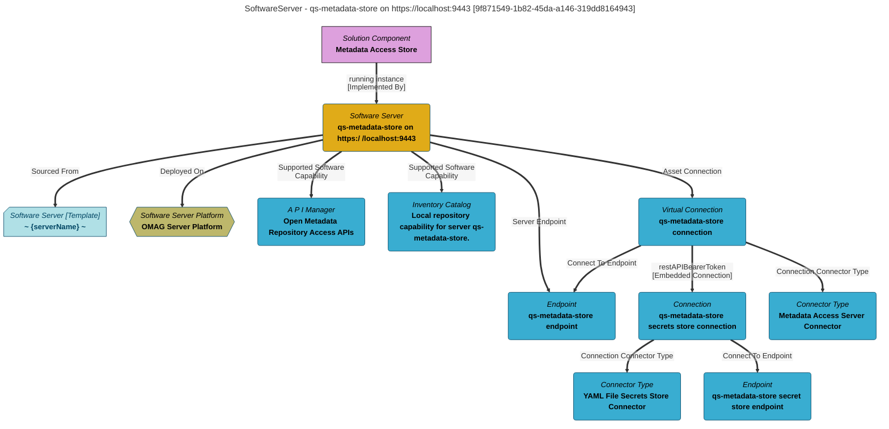

> qs-metadata-store on https://localhost:9443: A metadata store that supports Open Metadata Access Services (OMASs) with event notifications.  It provides metadata to qs-view-server, qs-engine-host and qs-integration-daemon. (Extracted from 6.0-SNAPSHOT)
