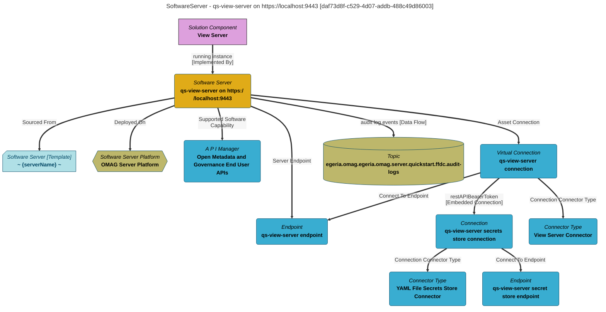

```mermaid
---
title: SoftwareServer - qs-view-server on https://localhost:9443 [daf73d8f-c529-4d07-addb-488c49d86003]
---
flowchart TD
%%{init: {"flowchart": {"htmlLabels": false}} }%%

1@{ shape: rounded, label: "*Software Server*
**qs-view-server on https:/ /localhost:9443**"}
2@{ shape: card, label: "*Software Server [Template]*
**~ {serverName} ~**"}
1==>|"Sourced From"|2
3@{ shape: rounded, label: "*Endpoint*
**qs-view-server endpoint**"}
1==>|"Server Endpoint"|3
4@{ shape: hex, label: "*Software Server Platform*
**OMAG Server Platform**"}
1==>|"Deployed On"|4
5@{ shape: rounded, label: "*A P I Manager*
**Open Metadata and Governance End User APIs**"}
1==>|"Supported Software Capability"|5
6@{ shape: rounded, label: "*Virtual Connection*
**qs-view-server connection**"}
1==>|"Asset Connection"|6
7@{ shape: rounded, label: "*Connection*
**qs-view-server secrets store connection**"}
6==>|"restAPIBearerToken [Embedded Connection]"|7
8@{ shape: rounded, label: "*Connector Type*
**YAML File Secrets Store Connector**"}
7==>|"Connection Connector Type"|8
9@{ shape: rounded, label: "*Endpoint*
**qs-view-server secret store endpoint**"}
7==>|"Connect To Endpoint"|9
10@{ shape: rounded, label: "*Connector Type*
**View Server Connector**"}
6==>|"Connection Connector Type"|10
6==>|"Connect To Endpoint"|3
11@{ shape: rect, label: "*Solution Component*
**View Server**"}
11==>|"running instance [Implemented By]"|1
12@{ shape: cyl, label: "*Topic*
**egeria.omag.egeria.omag.server.quickstart.ffdc.audit-logs**"}
1==>|"audit log events [Data Flow]"|12
style 11 color:#000000, fill:#DDA0DD, stroke:#000000
style 1 color:#000000, fill:#e0ab18, stroke:#004563
style 12 color:#000000, fill:#BDB76B, stroke:#004563
style 2 color:#004563, fill:#b0e0e6, stroke:#004563
style 3 color:#000000, fill:#39add1, stroke:#004563
style 4 color:#000000, fill:#BDB76B, stroke:#004563
style 5 color:#000000, fill:#39add1, stroke:#004563
style 6 color:#000000, fill:#39add1, stroke:#004563
style 7 color:#000000, fill:#39add1, stroke:#004563
style 8 color:#000000, fill:#39add1, stroke:#004563
style 9 color:#000000, fill:#39add1, stroke:#004563
style 10 color:#000000, fill:#39add1, stroke:#004563
click 11 "https://egeria-project.org/concepts/metadata-access-server/" "Click for more documentation" _blank
click 1 "https://egeria-project.org/concepts/view-server/" "Click for more documentation" _blank
click 4 "https://egeria-project.org/concepts/omag-server-platform/" "Click for more documentation" _blank
```
> qs-view-server on https://localhost:9443: A server that supplies REST API endpoints for User Interfaces and non-Java environments such as Python. (Extracted from 6.0-SNAPSHOT)
