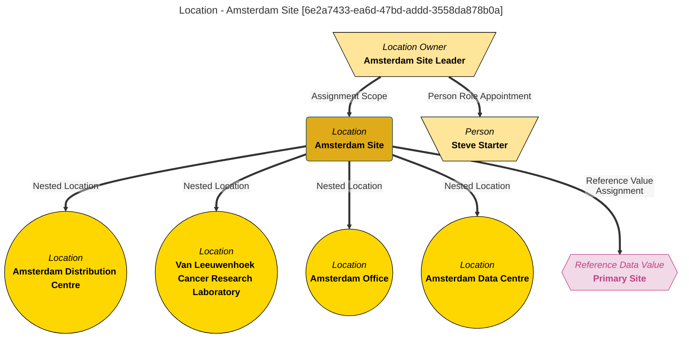

```mermaid
---
title: Location - Amsterdam Site [6e2a7433-ea6d-47bd-addd-3558da878b0a]
---
flowchart TD
%%{init: {"flowchart": {"htmlLabels": false}} }%%

1@{ shape: rounded, label: "*Location*
**Amsterdam Site**"}
2@{ shape: circle, label: "*Location*
**Amsterdam Distribution Centre**"}
1==>|"Nested Location"|2
3@{ shape: circle, label: "*Location*
**Van Leeuwenhoek Cancer Research Laboratory**"}
1==>|"Nested Location"|3
4@{ shape: circle, label: "*Location*
**Amsterdam Office**"}
1==>|"Nested Location"|4
5@{ shape: circle, label: "*Location*
**Amsterdam Data Centre**"}
1==>|"Nested Location"|5
6@{ shape: trap-t, label: "*Location Owner*
**Amsterdam Site Leader**"}
6==>|"Assignment Scope"|1
7@{ shape: trap-t, label: "*Person*
**Steve Starter**"}
6==>|"Person Role Appointment"|7
8@{ shape: hex, label: "*Reference Data Value*
**Primary Site**"}
1==>|"Reference Value Assignment"|8
style 1 color:#000000, fill:#e0ab18, stroke:#004563
style 2 color:#000000, fill:#FFD700, stroke:#000000
style 3 color:#000000, fill:#FFD700, stroke:#000000
style 4 color:#000000, fill:#FFD700, stroke:#000000
style 5 color:#000000, fill:#FFD700, stroke:#000000
style 6 color:#000000, fill:#FFE599, stroke:#000000
style 7 color:#000000, fill:#FFE599, stroke:#000000
style 8 color:#bf4086, fill:#f2d9e7, stroke:#bf4086
```
