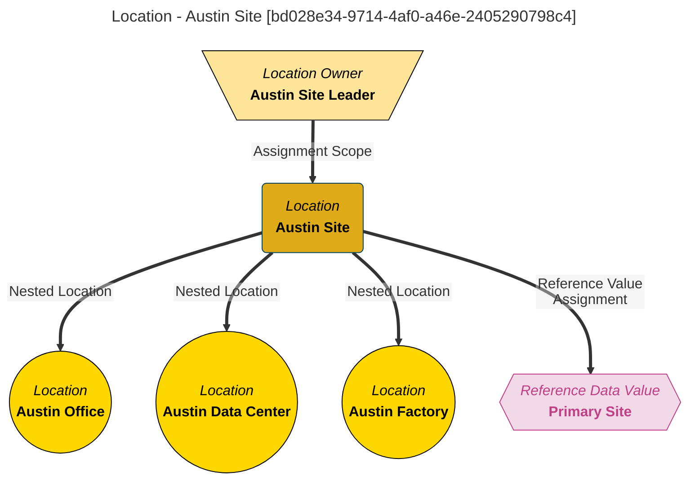

```mermaid
---
title: Location - Austin Site [bd028e34-9714-4af0-a46e-2405290798c4]
---
flowchart TD
%%{init: {"flowchart": {"htmlLabels": false}} }%%

1@{ shape: rounded, label: "*Location*
**Austin Site**"}
2@{ shape: circle, label: "*Location*
**Austin Office**"}
1==>|"Nested Location"|2
3@{ shape: circle, label: "*Location*
**Austin Data Center**"}
1==>|"Nested Location"|3
4@{ shape: circle, label: "*Location*
**Austin Factory**"}
1==>|"Nested Location"|4
5@{ shape: trap-t, label: "*Location Owner*
**Austin Site Leader**"}
5==>|"Assignment Scope"|1
6@{ shape: hex, label: "*Reference Data Value*
**Primary Site**"}
1==>|"Reference Value Assignment"|6
style 1 color:#000000, fill:#e0ab18, stroke:#004563
style 2 color:#000000, fill:#FFD700, stroke:#000000
style 3 color:#000000, fill:#FFD700, stroke:#000000
style 4 color:#000000, fill:#FFD700, stroke:#000000
style 5 color:#000000, fill:#FFE599, stroke:#000000
style 6 color:#bf4086, fill:#f2d9e7, stroke:#bf4086
```
