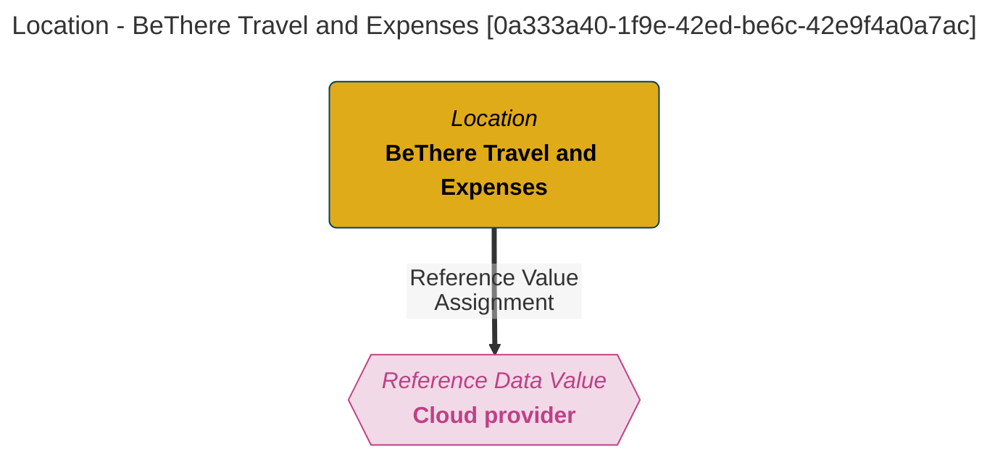

```mermaid
---
title: Location - BeThere Travel and Expenses [0a333a40-1f9e-42ed-be6c-42e9f4a0a7ac]
---
flowchart TD
%%{init: {"flowchart": {"htmlLabels": false}} }%%

1@{ shape: rounded, label: "*Location*
**BeThere Travel and Expenses**"}
2@{ shape: hex, label: "*Reference Data Value*
**Cloud provider**"}
1==>|"Reference Value Assignment"|2
style 1 color:#000000, fill:#e0ab18, stroke:#004563
style 2 color:#bf4086, fill:#f2d9e7, stroke:#bf4086
```
