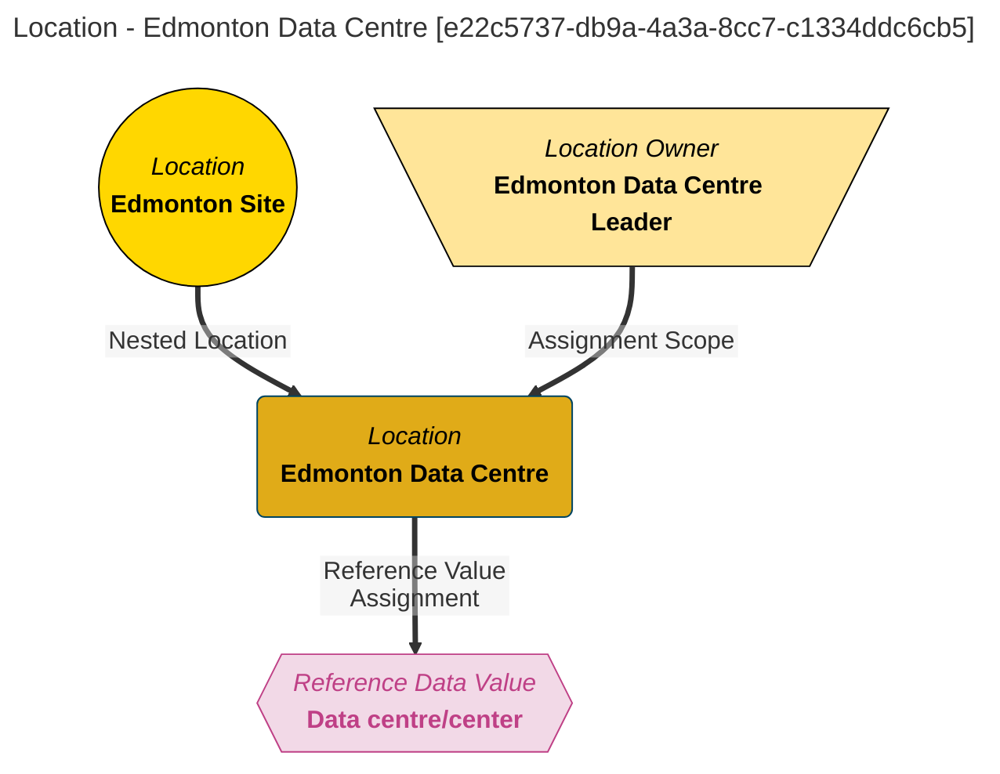

```mermaid
---
title: Location - Edmonton Data Centre [e22c5737-db9a-4a3a-8cc7-c1334ddc6cb5]
---
flowchart TD
%%{init: {"flowchart": {"htmlLabels": false}} }%%

1@{ shape: rounded, label: "*Location*
**Edmonton Data Centre**"}
2@{ shape: circle, label: "*Location*
**Edmonton Site**"}
2==>|"Nested Location"|1
3@{ shape: trap-t, label: "*Location Owner*
**Edmonton Data Centre Leader**"}
3==>|"Assignment Scope"|1
4@{ shape: hex, label: "*Reference Data Value*
**Data centre/center**"}
1==>|"Reference Value Assignment"|4
style 1 color:#000000, fill:#e0ab18, stroke:#004563
style 2 color:#000000, fill:#FFD700, stroke:#000000
style 3 color:#000000, fill:#FFE599, stroke:#000000
style 4 color:#bf4086, fill:#f2d9e7, stroke:#bf4086
```
