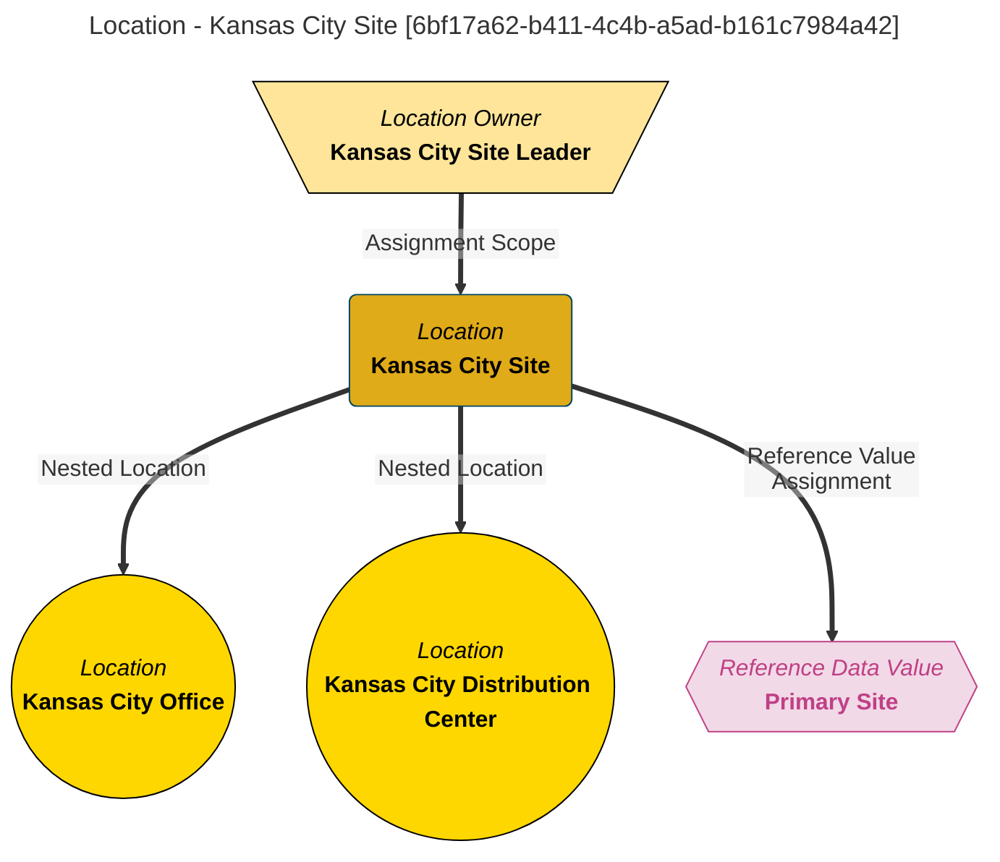

```mermaid
---
title: Location - Kansas City Site [6bf17a62-b411-4c4b-a5ad-b161c7984a42]
---
flowchart TD
%%{init: {"flowchart": {"htmlLabels": false}} }%%

1@{ shape: rounded, label: "*Location*
**Kansas City Site**"}
2@{ shape: circle, label: "*Location*
**Kansas City Office**"}
1==>|"Nested Location"|2
3@{ shape: circle, label: "*Location*
**Kansas City Distribution Center**"}
1==>|"Nested Location"|3
4@{ shape: trap-t, label: "*Location Owner*
**Kansas City Site Leader**"}
4==>|"Assignment Scope"|1
5@{ shape: hex, label: "*Reference Data Value*
**Primary Site**"}
1==>|"Reference Value Assignment"|5
style 1 color:#000000, fill:#e0ab18, stroke:#004563
style 2 color:#000000, fill:#FFD700, stroke:#000000
style 3 color:#000000, fill:#FFD700, stroke:#000000
style 4 color:#000000, fill:#FFE599, stroke:#000000
style 5 color:#bf4086, fill:#f2d9e7, stroke:#bf4086
```
