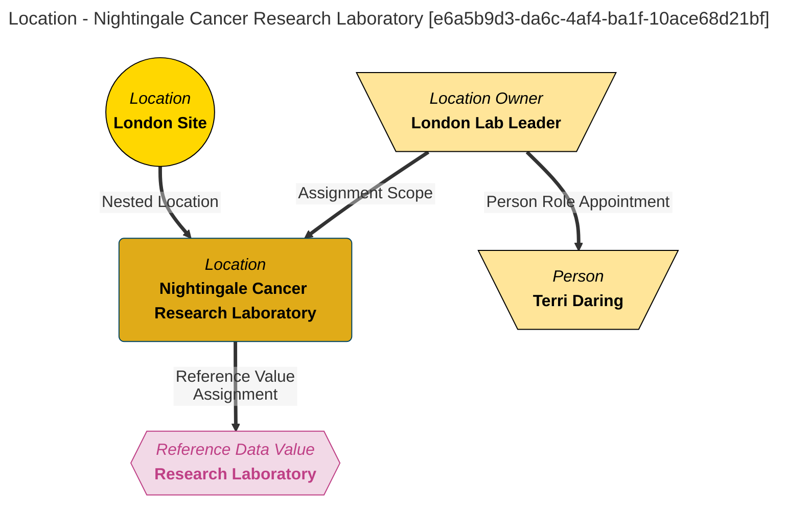

```mermaid
---
title: Location - Nightingale Cancer Research Laboratory [e6a5b9d3-da6c-4af4-ba1f-10ace68d21bf]
---
flowchart TD
%%{init: {"flowchart": {"htmlLabels": false}} }%%

1@{ shape: rounded, label: "*Location*
**Nightingale Cancer Research Laboratory**"}
2@{ shape: circle, label: "*Location*
**London Site**"}
2==>|"Nested Location"|1
3@{ shape: trap-t, label: "*Location Owner*
**London Lab Leader**"}
3==>|"Assignment Scope"|1
4@{ shape: trap-t, label: "*Person*
**Terri Daring**"}
3==>|"Person Role Appointment"|4
5@{ shape: hex, label: "*Reference Data Value*
**Research Laboratory**"}
1==>|"Reference Value Assignment"|5
style 1 color:#000000, fill:#e0ab18, stroke:#004563
style 2 color:#000000, fill:#FFD700, stroke:#000000
style 3 color:#000000, fill:#FFE599, stroke:#000000
style 4 color:#000000, fill:#FFE599, stroke:#000000
style 5 color:#bf4086, fill:#f2d9e7, stroke:#bf4086
```
