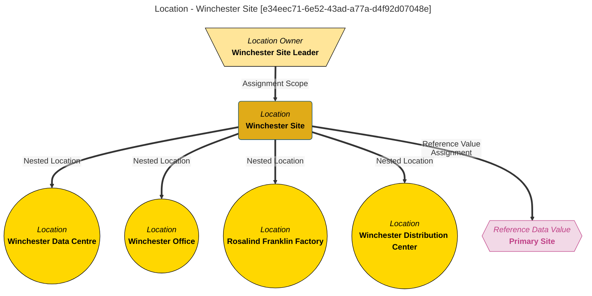

```mermaid
---
title: Location - Winchester Site [e34eec71-6e52-43ad-a77a-d4f92d07048e]
---
flowchart TD
%%{init: {"flowchart": {"htmlLabels": false}} }%%

1@{ shape: rounded, label: "*Location*
**Winchester Site**"}
2@{ shape: circle, label: "*Location*
**Winchester Data Centre**"}
1==>|"Nested Location"|2
3@{ shape: circle, label: "*Location*
**Winchester Office**"}
1==>|"Nested Location"|3
4@{ shape: circle, label: "*Location*
**Rosalind Franklin Factory**"}
1==>|"Nested Location"|4
5@{ shape: circle, label: "*Location*
**Winchester Distribution Center**"}
1==>|"Nested Location"|5
6@{ shape: trap-t, label: "*Location Owner*
**Winchester Site Leader**"}
6==>|"Assignment Scope"|1
7@{ shape: hex, label: "*Reference Data Value*
**Primary Site**"}
1==>|"Reference Value Assignment"|7
style 1 color:#000000, fill:#e0ab18, stroke:#004563
style 2 color:#000000, fill:#FFD700, stroke:#000000
style 3 color:#000000, fill:#FFD700, stroke:#000000
style 4 color:#000000, fill:#FFD700, stroke:#000000
style 5 color:#000000, fill:#FFD700, stroke:#000000
style 6 color:#000000, fill:#FFE599, stroke:#000000
style 7 color:#bf4086, fill:#f2d9e7, stroke:#bf4086
```
