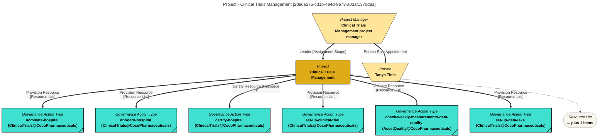

```mermaid
---
title: Project - Clinical Trials Management [2d86e375-c31b-494d-9e73-a03af1370d81]
---
flowchart TD
%%{init: {"flowchart": {"htmlLabels": false}} }%%

1@{ shape: rounded, label: "*Project*
**Clinical Trials Management**"}
2@{ shape: tag-rect, label: "*Governance Action Type*
**nominate-hospital (ClinicalTrials@CocoPharmaceuticals)**"}
1==>|"Provision Resource [Resource List]"|2
3@{ shape: tag-rect, label: "*Governance Action Type*
**onboard-hospital (ClinicalTrials@CocoPharmaceuticals)**"}
1==>|"Provision Resource [Resource List]"|3
4@{ shape: tag-rect, label: "*Governance Action Type*
**certify-hospital (ClinicalTrials@CocoPharmaceuticals)**"}
1==>|"Certify Resource [Resource List]"|4
5@{ shape: tag-rect, label: "*Governance Action Type*
**set-up-clinical-trial (ClinicalTrials@CocoPharmaceuticals)**"}
1==>|"Provision Resource [Resource List]"|5
6@{ shape: tag-rect, label: "*Governance Action Type*
**check-weekly-measurements-data-quality (AssetQuality@CocoPharmaceuticals)**"}
1==>|"Validate Resource [Resource List]"|6
7@{ shape: tag-rect, label: "*Governance Action Type*
**set-up-data-lake (ClinicalTrials@CocoPharmaceuticals)**"}
1==>|"Provision Resource [Resource List]"|7
8@{ shape: stadium, label: "*Resource List*
**... plus 1 Items**"}
1-.->8
9@{ shape: trap-t, label: "*Project Manager*
**Clinical Trials Management project manager**"}
9==>|"Leader [Assignment Scope]"|1
10@{ shape: trap-t, label: "*Person*
**Tanya Tidie**"}
9==>|"Person Role Appointment"|10
style 1 color:#000000, fill:#e0ab18, stroke:#004563
style 2 color:#000000, fill:#40E0D0, stroke:#000000
style 3 color:#000000, fill:#40E0D0, stroke:#000000
style 4 color:#000000, fill:#40E0D0, stroke:#000000
style 5 color:#000000, fill:#40E0D0, stroke:#000000
style 6 color:#000000, fill:#40E0D0, stroke:#000000
style 7 color:#000000, fill:#40E0D0, stroke:#000000
style 8 color:#000000, fill:#F9F7ED, stroke:#b7c0c7
style 9 color:#000000, fill:#FFE599, stroke:#000000
style 10 color:#000000, fill:#FFE599, stroke:#000000
```
