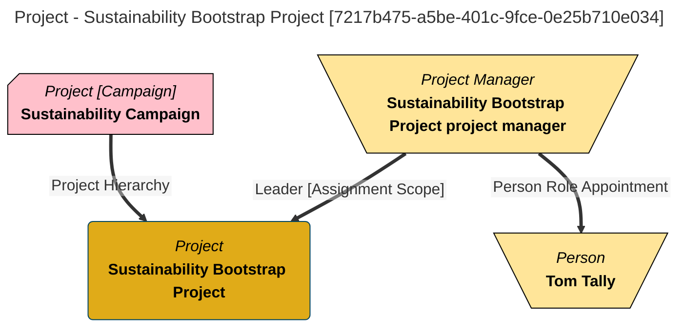

```mermaid
---
title: Project - Sustainability Bootstrap Project [7217b475-a5be-401c-9fce-0e25b710e034]
---
flowchart TD
%%{init: {"flowchart": {"htmlLabels": false}} }%%

1@{ shape: rounded, label: "*Project*
**Sustainability Bootstrap Project**"}
2@{ shape: trap-t, label: "*Project Manager*
**Sustainability Bootstrap Project project manager**"}
2==>|"Leader [Assignment Scope]"|1
3@{ shape: trap-t, label: "*Person*
**Tom Tally**"}
2==>|"Person Role Appointment"|3
4@{ shape: notch-rect, label: "*Project [Campaign]*
**Sustainability Campaign**"}
4==>|"Project Hierarchy"|1
style 1 color:#000000, fill:#e0ab18, stroke:#004563
style 2 color:#000000, fill:#FFE599, stroke:#000000
style 3 color:#000000, fill:#FFE599, stroke:#000000
style 4 color:#000000, fill:#FFC0CB, stroke:#000000
```
