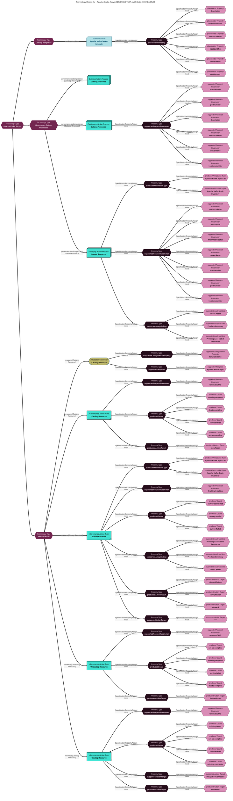

```mermaid
---
title: Technology Report for - Apache Kafka Server [47ab900d-7507-4a52-8b1e-f1692dcb97e0]
---
flowchart LR
%%{init: {"flowchart": {"htmlLabels": false}} }%%

1@{ shape: hex, label: "*Technology Type*
**Apache Kafka Server**"}
2@{ shape: hex, label: "*Technology Type*
**Catalog Templates**"}
1==>2
3@{ shape: card, label: "*Software Server*
**Apache Kafka Server template**"}
2==>|"catalog templates"|3
4@{ shape: hex, label: "*Property Type*
**placeholderProperty**"}
3==>|"SpecificationPropertyAssignment"|4
5@{ shape: hex, label: "*placeholder Property*
**description**"}
4==>|"SpecificationPropertyAssignment"|5
6@{ shape: hex, label: "*placeholder Property*
**versionIdentifier**"}
4==>|"SpecificationPropertyAssignment"|6
7@{ shape: hex, label: "*placeholder Property*
**resourceName**"}
4==>|"SpecificationPropertyAssignment"|7
8@{ shape: hex, label: "*placeholder Property*
**hostIdentifier**"}
4==>|"SpecificationPropertyAssignment"|8
9@{ shape: hex, label: "*placeholder Property*
**serverName**"}
4==>|"SpecificationPropertyAssignment"|9
10@{ shape: hex, label: "*placeholder Property*
**portNumber**"}
4==>|"SpecificationPropertyAssignment"|10
11@{ shape: hex, label: "*Technology Type*
**Governance Action Processes**"}
1==>11
12@{ shape: processes, label: "*Deleting Action Process*
**Catalog Resource**"}
11==>|"governance action process [Catalog Resource]"|12
13@{ shape: processes, label: "*Cataloguing Action Process*
**Catalog Resource**"}
11==>|"governance action process [Catalog Resource]"|13
14@{ shape: hex, label: "*Property Type*
**supportedRequestParameter**"}
13==>|"SpecificationPropertyAssignment"|14
15@{ shape: hex, label: "*supported Request Parameter*
**hostIdentifier**"}
14==>|"SpecificationPropertyAssignment"|15
16@{ shape: hex, label: "*supported Request Parameter*
**portNumber**"}
14==>|"SpecificationPropertyAssignment"|16
17@{ shape: hex, label: "*supported Request Parameter*
**description**"}
14==>|"SpecificationPropertyAssignment"|17
18@{ shape: hex, label: "*supported Request Parameter*
**resourceName**"}
14==>|"SpecificationPropertyAssignment"|18
19@{ shape: hex, label: "*supported Request Parameter*
**serverName**"}
14==>|"SpecificationPropertyAssignment"|19
20@{ shape: hex, label: "*supported Request Parameter*
**versionIdentifier**"}
14==>|"SpecificationPropertyAssignment"|20
21@{ shape: processes, label: "*Surveying Action Process*
**Survey Resource**"}
11==>|"governance action process [Survey Resource]"|21
22@{ shape: hex, label: "*Property Type*
**producedAnnotationType**"}
21==>|"SpecificationPropertyAssignment"|22
23@{ shape: hex, label: "*produced Annotation Type*
**Apache Kafka Topic List**"}
22==>|"SpecificationPropertyAssignment"|23
24@{ shape: hex, label: "*produced Annotation Type*
**Apache Kafka Topic Inventory**"}
22==>|"SpecificationPropertyAssignment"|24
25@{ shape: hex, label: "*Property Type*
**supportedRequestParameter**"}
21==>|"SpecificationPropertyAssignment"|25
26@{ shape: hex, label: "*supported Request Parameter*
**resourceName**"}
25==>|"SpecificationPropertyAssignment"|26
27@{ shape: hex, label: "*supported Request Parameter*
**description**"}
25==>|"SpecificationPropertyAssignment"|27
28@{ shape: hex, label: "*supported Request Parameter*
**finalAnalysisStep**"}
25==>|"SpecificationPropertyAssignment"|28
29@{ shape: hex, label: "*supported Request Parameter*
**serverName**"}
25==>|"SpecificationPropertyAssignment"|29
30@{ shape: hex, label: "*supported Request Parameter*
**hostIdentifier**"}
25==>|"SpecificationPropertyAssignment"|30
31@{ shape: hex, label: "*supported Request Parameter*
**portNumber**"}
25==>|"SpecificationPropertyAssignment"|31
32@{ shape: hex, label: "*supported Request Parameter*
**versionIdentifier**"}
25==>|"SpecificationPropertyAssignment"|32
33@{ shape: hex, label: "*Property Type*
**supportedAnalysisStep**"}
21==>|"SpecificationPropertyAssignment"|33
34@{ shape: hex, label: "*supported Analysis Step*
**Check Asset**"}
33==>|"SpecificationPropertyAssignment"|34
35@{ shape: hex, label: "*supported Analysis Step*
**Produce Inventory**"}
33==>|"SpecificationPropertyAssignment"|35
36@{ shape: hex, label: "*supported Analysis Step*
**Profiling Associated Resources**"}
33==>|"SpecificationPropertyAssignment"|36
37@{ shape: hex, label: "*Technology Type*
**Resource List**"}
1==>37
38@{ shape: stadium, label: "*Integration Connector*
**Catalog Resource**"}
37==>|"resource [Catalog Resource]"|38
39@{ shape: hex, label: "*Property Type*
**supportedConfigurationProperty**"}
38==>|"SpecificationPropertyAssignment"|39
40@{ shape: hex, label: "*supported Configuration Property*
**templateName**"}
39==>|"SpecificationPropertyAssignment"|40
41@{ shape: hex, label: "*Property Type*
**supportedTemplate**"}
38==>|"SpecificationPropertyAssignment"|41
42@{ shape: hex, label: "*supported Template*
**Apache Kafka Topic**"}
41==>|"SpecificationPropertyAssignment"|42
43@{ shape: tag-rect, label: "*Governance Action Type*
**Catalog Resource**"}
37==>|"resource [Catalog Resource]"|43
44@{ shape: hex, label: "*Property Type*
**supportedRequestParameter**"}
43==>|"SpecificationPropertyAssignment"|44
45@{ shape: hex, label: "*supported Request Parameter*
**templateGUID**"}
44==>|"SpecificationPropertyAssignment"|45
46@{ shape: hex, label: "*Property Type*
**producedGuard**"}
43==>|"SpecificationPropertyAssignment"|46
47@{ shape: hex, label: "*produced Guard*
**missing-template**"}
46==>|"SpecificationPropertyAssignment"|47
48@{ shape: hex, label: "*produced Guard*
**delete-complete**"}
46==>|"SpecificationPropertyAssignment"|48
49@{ shape: hex, label: "*produced Guard*
**service-failed**"}
46==>|"SpecificationPropertyAssignment"|49
50@{ shape: hex, label: "*produced Guard*
**set-up-complete**"}
46==>|"SpecificationPropertyAssignment"|50
51@{ shape: hex, label: "*Property Type*
**producedActionTarget**"}
43==>|"SpecificationPropertyAssignment"|51
52@{ shape: hex, label: "*produced Action Target*
**newAsset**"}
51==>|"SpecificationPropertyAssignment"|52
53@{ shape: tag-rect, label: "*Governance Action Type*
**Survey Resource**"}
37==>|"resource [Survey Resource]"|53
54@{ shape: hex, label: "*Property Type*
**producedAnnotationType**"}
53==>|"SpecificationPropertyAssignment"|54
55@{ shape: hex, label: "*produced Annotation Type*
**Apache Kafka Topic List**"}
54==>|"SpecificationPropertyAssignment"|55
56@{ shape: hex, label: "*produced Annotation Type*
**Apache Kafka Topic Inventory**"}
54==>|"SpecificationPropertyAssignment"|56
57@{ shape: hex, label: "*Property Type*
**supportedRequestParameter**"}
53==>|"SpecificationPropertyAssignment"|57
58@{ shape: hex, label: "*supported Request Parameter*
**finalAnalysisStep**"}
57==>|"SpecificationPropertyAssignment"|58
59@{ shape: hex, label: "*Property Type*
**producedGuard**"}
53==>|"SpecificationPropertyAssignment"|59
60@{ shape: hex, label: "*produced Guard*
**survey-completed**"}
59==>|"SpecificationPropertyAssignment"|60
61@{ shape: hex, label: "*produced Guard*
**survey-invalid**"}
59==>|"SpecificationPropertyAssignment"|61
62@{ shape: hex, label: "*produced Guard*
**survey-failed**"}
59==>|"SpecificationPropertyAssignment"|62
63@{ shape: hex, label: "*Property Type*
**supportedAnalysisStep**"}
53==>|"SpecificationPropertyAssignment"|63
64@{ shape: hex, label: "*supported Analysis Step*
**Profiling Associated Resources**"}
63==>|"SpecificationPropertyAssignment"|64
65@{ shape: hex, label: "*supported Analysis Step*
**Produce Inventory**"}
63==>|"SpecificationPropertyAssignment"|65
66@{ shape: hex, label: "*supported Analysis Step*
**Check Asset**"}
63==>|"SpecificationPropertyAssignment"|66
67@{ shape: hex, label: "*Property Type*
**producedActionTarget**"}
53==>|"SpecificationPropertyAssignment"|67
68@{ shape: hex, label: "*produced Action Target*
**stewardAction**"}
67==>|"SpecificationPropertyAssignment"|68
69@{ shape: hex, label: "*produced Action Target*
**surveyReport**"}
67==>|"SpecificationPropertyAssignment"|69
70@{ shape: hex, label: "*produced Action Target*
**steward**"}
67==>|"SpecificationPropertyAssignment"|70
71@{ shape: hex, label: "*Property Type*
**supportedActionTarget**"}
53==>|"SpecificationPropertyAssignment"|71
72@{ shape: hex, label: "*supported Action Target*
*****"}
71==>|"SpecificationPropertyAssignment"|72
73@{ shape: tag-rect, label: "*Governance Action Type*
**Uncatalog Resource**"}
37==>|"resource [Uncatalog Resource]"|73
74@{ shape: hex, label: "*Property Type*
**supportedRequestParameter**"}
73==>|"SpecificationPropertyAssignment"|74
75@{ shape: hex, label: "*supported Request Parameter*
**templateGUID**"}
74==>|"SpecificationPropertyAssignment"|75
76@{ shape: hex, label: "*Property Type*
**producedGuard**"}
73==>|"SpecificationPropertyAssignment"|76
77@{ shape: hex, label: "*produced Guard*
**set-up-complete**"}
76==>|"SpecificationPropertyAssignment"|77
78@{ shape: hex, label: "*produced Guard*
**missing-template**"}
76==>|"SpecificationPropertyAssignment"|78
79@{ shape: hex, label: "*produced Guard*
**service-failed**"}
76==>|"SpecificationPropertyAssignment"|79
80@{ shape: hex, label: "*produced Guard*
**delete-complete**"}
76==>|"SpecificationPropertyAssignment"|80
81@{ shape: hex, label: "*Property Type*
**producedActionTarget**"}
73==>|"SpecificationPropertyAssignment"|81
82@{ shape: hex, label: "*produced Action Target*
**deletedAsset**"}
81==>|"SpecificationPropertyAssignment"|82
83@{ shape: tag-rect, label: "*Governance Action Type*
**Catalog Resource**"}
37==>|"resource [Catalog Resource]"|83
84@{ shape: hex, label: "*Property Type*
**supportedRequestParameter**"}
83==>|"SpecificationPropertyAssignment"|84
85@{ shape: hex, label: "*supported Request Parameter*
**templateGUID**"}
84==>|"SpecificationPropertyAssignment"|85
86@{ shape: hex, label: "*Property Type*
**producedGuard**"}
83==>|"SpecificationPropertyAssignment"|86
87@{ shape: hex, label: "*produced Guard*
**missing-asset**"}
86==>|"SpecificationPropertyAssignment"|87
88@{ shape: hex, label: "*produced Guard*
**set-up-complete**"}
86==>|"SpecificationPropertyAssignment"|88
89@{ shape: hex, label: "*produced Guard*
**service-failed**"}
86==>|"SpecificationPropertyAssignment"|89
90@{ shape: hex, label: "*produced Guard*
**missing-connector**"}
86==>|"SpecificationPropertyAssignment"|90
91@{ shape: hex, label: "*Property Type*
**supportedActionTarget**"}
83==>|"SpecificationPropertyAssignment"|91
92@{ shape: hex, label: "*supported Action Target*
**integrationConnector**"}
91==>|"SpecificationPropertyAssignment"|92
93@{ shape: hex, label: "*Property Type*
**producedActionTarget**"}
83==>|"SpecificationPropertyAssignment"|93
94@{ shape: hex, label: "*produced Action Target*
**newAsset**"}
93==>|"SpecificationPropertyAssignment"|94
style 44 color:#f2d9e7, fill:#260d1b, stroke:#f2d9e7
style 88 color:#260d1b, fill:#d98cb6, stroke:#260d1b
style 45 color:#260d1b, fill:#d98cb6, stroke:#260d1b
style 89 color:#260d1b, fill:#d98cb6, stroke:#260d1b
style 46 color:#f2d9e7, fill:#260d1b, stroke:#f2d9e7
style 47 color:#260d1b, fill:#d98cb6, stroke:#260d1b
style 48 color:#260d1b, fill:#d98cb6, stroke:#260d1b
style 49 color:#260d1b, fill:#d98cb6, stroke:#260d1b
style 90 color:#260d1b, fill:#d98cb6, stroke:#260d1b
style 91 color:#f2d9e7, fill:#260d1b, stroke:#f2d9e7
style 92 color:#260d1b, fill:#d98cb6, stroke:#260d1b
style 93 color:#f2d9e7, fill:#260d1b, stroke:#f2d9e7
style 50 color:#260d1b, fill:#d98cb6, stroke:#260d1b
style 94 color:#260d1b, fill:#d98cb6, stroke:#260d1b
style 51 color:#f2d9e7, fill:#260d1b, stroke:#f2d9e7
style 52 color:#260d1b, fill:#d98cb6, stroke:#260d1b
style 53 color:#000000, fill:#40E0D0, stroke:#000000
style 10 color:#260d1b, fill:#d98cb6, stroke:#260d1b
style 54 color:#f2d9e7, fill:#260d1b, stroke:#f2d9e7
style 11 color:#f2d9e7, fill:#732650, stroke:#f2d9e7
style 55 color:#260d1b, fill:#d98cb6, stroke:#260d1b
style 12 color:#000000, fill:#40E0D0, stroke:#000000
style 56 color:#260d1b, fill:#d98cb6, stroke:#260d1b
style 13 color:#000000, fill:#40E0D0, stroke:#000000
style 57 color:#f2d9e7, fill:#260d1b, stroke:#f2d9e7
style 14 color:#f2d9e7, fill:#260d1b, stroke:#f2d9e7
style 58 color:#260d1b, fill:#d98cb6, stroke:#260d1b
style 15 color:#260d1b, fill:#d98cb6, stroke:#260d1b
style 59 color:#f2d9e7, fill:#260d1b, stroke:#f2d9e7
style 16 color:#260d1b, fill:#d98cb6, stroke:#260d1b
style 17 color:#260d1b, fill:#d98cb6, stroke:#260d1b
style 18 color:#260d1b, fill:#d98cb6, stroke:#260d1b
style 19 color:#260d1b, fill:#d98cb6, stroke:#260d1b
style 1 color:#f2d9e7, fill:#732650, stroke:#f2d9e7
style 2 color:#f2d9e7, fill:#732650, stroke:#f2d9e7
style 3 color:#004563, fill:#b0e0e6, stroke:#004563
style 4 color:#f2d9e7, fill:#260d1b, stroke:#f2d9e7
style 5 color:#260d1b, fill:#d98cb6, stroke:#260d1b
style 6 color:#260d1b, fill:#d98cb6, stroke:#260d1b
style 7 color:#260d1b, fill:#d98cb6, stroke:#260d1b
style 8 color:#260d1b, fill:#d98cb6, stroke:#260d1b
style 9 color:#260d1b, fill:#d98cb6, stroke:#260d1b
style 60 color:#260d1b, fill:#d98cb6, stroke:#260d1b
style 61 color:#260d1b, fill:#d98cb6, stroke:#260d1b
style 62 color:#260d1b, fill:#d98cb6, stroke:#260d1b
style 63 color:#f2d9e7, fill:#260d1b, stroke:#f2d9e7
style 20 color:#260d1b, fill:#d98cb6, stroke:#260d1b
style 64 color:#260d1b, fill:#d98cb6, stroke:#260d1b
style 21 color:#000000, fill:#40E0D0, stroke:#000000
style 65 color:#260d1b, fill:#d98cb6, stroke:#260d1b
style 22 color:#f2d9e7, fill:#260d1b, stroke:#f2d9e7
style 66 color:#260d1b, fill:#d98cb6, stroke:#260d1b
style 23 color:#260d1b, fill:#d98cb6, stroke:#260d1b
style 67 color:#f2d9e7, fill:#260d1b, stroke:#f2d9e7
style 24 color:#260d1b, fill:#d98cb6, stroke:#260d1b
style 68 color:#260d1b, fill:#d98cb6, stroke:#260d1b
style 25 color:#f2d9e7, fill:#260d1b, stroke:#f2d9e7
style 69 color:#260d1b, fill:#d98cb6, stroke:#260d1b
style 26 color:#260d1b, fill:#d98cb6, stroke:#260d1b
style 27 color:#260d1b, fill:#d98cb6, stroke:#260d1b
style 28 color:#260d1b, fill:#d98cb6, stroke:#260d1b
style 29 color:#260d1b, fill:#d98cb6, stroke:#260d1b
style 70 color:#260d1b, fill:#d98cb6, stroke:#260d1b
style 71 color:#f2d9e7, fill:#260d1b, stroke:#f2d9e7
style 72 color:#260d1b, fill:#d98cb6, stroke:#260d1b
style 73 color:#000000, fill:#40E0D0, stroke:#000000
style 30 color:#260d1b, fill:#d98cb6, stroke:#260d1b
style 74 color:#f2d9e7, fill:#260d1b, stroke:#f2d9e7
style 31 color:#260d1b, fill:#d98cb6, stroke:#260d1b
style 75 color:#260d1b, fill:#d98cb6, stroke:#260d1b
style 32 color:#260d1b, fill:#d98cb6, stroke:#260d1b
style 76 color:#f2d9e7, fill:#260d1b, stroke:#f2d9e7
style 33 color:#f2d9e7, fill:#260d1b, stroke:#f2d9e7
style 77 color:#260d1b, fill:#d98cb6, stroke:#260d1b
style 34 color:#260d1b, fill:#d98cb6, stroke:#260d1b
style 78 color:#260d1b, fill:#d98cb6, stroke:#260d1b
style 35 color:#260d1b, fill:#d98cb6, stroke:#260d1b
style 79 color:#260d1b, fill:#d98cb6, stroke:#260d1b
style 36 color:#260d1b, fill:#d98cb6, stroke:#260d1b
style 37 color:#f2d9e7, fill:#732650, stroke:#f2d9e7
style 38 color:#000000, fill:#BDB76B, stroke:#004563
style 39 color:#f2d9e7, fill:#260d1b, stroke:#f2d9e7
style 80 color:#260d1b, fill:#d98cb6, stroke:#260d1b
style 81 color:#f2d9e7, fill:#260d1b, stroke:#f2d9e7
style 82 color:#260d1b, fill:#d98cb6, stroke:#260d1b
style 83 color:#000000, fill:#40E0D0, stroke:#000000
style 40 color:#260d1b, fill:#d98cb6, stroke:#260d1b
style 84 color:#f2d9e7, fill:#260d1b, stroke:#f2d9e7
style 41 color:#f2d9e7, fill:#260d1b, stroke:#f2d9e7
style 85 color:#260d1b, fill:#d98cb6, stroke:#260d1b
style 42 color:#260d1b, fill:#d98cb6, stroke:#260d1b
style 86 color:#f2d9e7, fill:#260d1b, stroke:#f2d9e7
style 43 color:#000000, fill:#40E0D0, stroke:#000000
style 87 color:#260d1b, fill:#d98cb6, stroke:#260d1b
```
