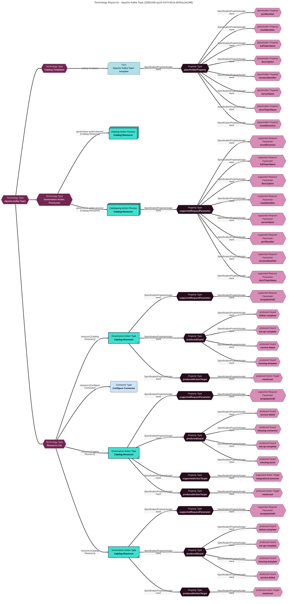

```mermaid
---
title: Technology Report for - Apache Kafka Topic [20f81045-aa24-4374-92cb-d045ac3e24f6]
---
flowchart LR
%%{init: {"flowchart": {"htmlLabels": false}} }%%

1@{ shape: hex, label: "*Technology Type*
**Apache Kafka Topic**"}
2@{ shape: hex, label: "*Technology Type*
**Catalog Templates**"}
1==>2
3@{ shape: card, label: "*Topic*
**Apache Kafka Topic template**"}
2==>|"catalog templates"|3
4@{ shape: hex, label: "*Property Type*
**placeholderProperty**"}
3==>|"SpecificationPropertyAssignment"|4
5@{ shape: hex, label: "*placeholder Property*
**portNumber**"}
4==>|"SpecificationPropertyAssignment"|5
6@{ shape: hex, label: "*placeholder Property*
**hostIdentifier**"}
4==>|"SpecificationPropertyAssignment"|6
7@{ shape: hex, label: "*placeholder Property*
**fullTopicName**"}
4==>|"SpecificationPropertyAssignment"|7
8@{ shape: hex, label: "*placeholder Property*
**description**"}
4==>|"SpecificationPropertyAssignment"|8
9@{ shape: hex, label: "*placeholder Property*
**versionIdentifier**"}
4==>|"SpecificationPropertyAssignment"|9
10@{ shape: hex, label: "*placeholder Property*
**serverName**"}
4==>|"SpecificationPropertyAssignment"|10
11@{ shape: hex, label: "*placeholder Property*
**shortTopicName**"}
4==>|"SpecificationPropertyAssignment"|11
12@{ shape: hex, label: "*placeholder Property*
**eventDirection**"}
4==>|"SpecificationPropertyAssignment"|12
13@{ shape: hex, label: "*Technology Type*
**Governance Action Processes**"}
1==>13
14@{ shape: processes, label: "*Deleting Action Process*
**Catalog Resource**"}
13==>|"governance action process [Catalog Resource]"|14
15@{ shape: processes, label: "*Cataloguing Action Process*
**Catalog Resource**"}
13==>|"governance action process [Catalog Resource]"|15
16@{ shape: hex, label: "*Property Type*
**supportedRequestParameter**"}
15==>|"SpecificationPropertyAssignment"|16
17@{ shape: hex, label: "*supported Request Parameter*
**eventDirection**"}
16==>|"SpecificationPropertyAssignment"|17
18@{ shape: hex, label: "*supported Request Parameter*
**fullTopicName**"}
16==>|"SpecificationPropertyAssignment"|18
19@{ shape: hex, label: "*supported Request Parameter*
**description**"}
16==>|"SpecificationPropertyAssignment"|19
20@{ shape: hex, label: "*supported Request Parameter*
**hostIdentifier**"}
16==>|"SpecificationPropertyAssignment"|20
21@{ shape: hex, label: "*supported Request Parameter*
**serverName**"}
16==>|"SpecificationPropertyAssignment"|21
22@{ shape: hex, label: "*supported Request Parameter*
**portNumber**"}
16==>|"SpecificationPropertyAssignment"|22
23@{ shape: hex, label: "*supported Request Parameter*
**versionIdentifier**"}
16==>|"SpecificationPropertyAssignment"|23
24@{ shape: hex, label: "*supported Request Parameter*
**shortTopicName**"}
16==>|"SpecificationPropertyAssignment"|24
25@{ shape: hex, label: "*Technology Type*
**Resource List**"}
1==>25
26@{ shape: tag-rect, label: "*Governance Action Type*
**Catalog Resource**"}
25==>|"resource [Catalog Resource]"|26
27@{ shape: hex, label: "*Property Type*
**supportedRequestParameter**"}
26==>|"SpecificationPropertyAssignment"|27
28@{ shape: hex, label: "*supported Request Parameter*
**templateGUID**"}
27==>|"SpecificationPropertyAssignment"|28
29@{ shape: hex, label: "*Property Type*
**producedGuard**"}
26==>|"SpecificationPropertyAssignment"|29
30@{ shape: hex, label: "*produced Guard*
**delete-complete**"}
29==>|"SpecificationPropertyAssignment"|30
31@{ shape: hex, label: "*produced Guard*
**set-up-complete**"}
29==>|"SpecificationPropertyAssignment"|31
32@{ shape: hex, label: "*produced Guard*
**service-failed**"}
29==>|"SpecificationPropertyAssignment"|32
33@{ shape: hex, label: "*produced Guard*
**missing-template**"}
29==>|"SpecificationPropertyAssignment"|33
34@{ shape: hex, label: "*Property Type*
**producedActionTarget**"}
26==>|"SpecificationPropertyAssignment"|34
35@{ shape: hex, label: "*produced Action Target*
**newAsset**"}
34==>|"SpecificationPropertyAssignment"|35
36@{ shape: rounded, label: "*Connector Type*
**Configure Connector**"}
25==>|"resource [Configure Connector]"|36
37@{ shape: tag-rect, label: "*Governance Action Type*
**Catalog Resource**"}
25==>|"resource [Catalog Resource]"|37
38@{ shape: hex, label: "*Property Type*
**supportedRequestParameter**"}
37==>|"SpecificationPropertyAssignment"|38
39@{ shape: hex, label: "*supported Request Parameter*
**templateGUID**"}
38==>|"SpecificationPropertyAssignment"|39
40@{ shape: hex, label: "*Property Type*
**producedGuard**"}
37==>|"SpecificationPropertyAssignment"|40
41@{ shape: hex, label: "*produced Guard*
**service-failed**"}
40==>|"SpecificationPropertyAssignment"|41
42@{ shape: hex, label: "*produced Guard*
**missing-connector**"}
40==>|"SpecificationPropertyAssignment"|42
43@{ shape: hex, label: "*produced Guard*
**set-up-complete**"}
40==>|"SpecificationPropertyAssignment"|43
44@{ shape: hex, label: "*produced Guard*
**missing-asset**"}
40==>|"SpecificationPropertyAssignment"|44
45@{ shape: hex, label: "*Property Type*
**supportedActionTarget**"}
37==>|"SpecificationPropertyAssignment"|45
46@{ shape: hex, label: "*supported Action Target*
**integrationConnector**"}
45==>|"SpecificationPropertyAssignment"|46
47@{ shape: hex, label: "*Property Type*
**producedActionTarget**"}
37==>|"SpecificationPropertyAssignment"|47
48@{ shape: hex, label: "*produced Action Target*
**newAsset**"}
47==>|"SpecificationPropertyAssignment"|48
49@{ shape: tag-rect, label: "*Governance Action Type*
**Catalog Resource**"}
25==>|"resource [Catalog Resource]"|49
50@{ shape: hex, label: "*Property Type*
**supportedRequestParameter**"}
49==>|"SpecificationPropertyAssignment"|50
51@{ shape: hex, label: "*supported Request Parameter*
**templateGUID**"}
50==>|"SpecificationPropertyAssignment"|51
52@{ shape: hex, label: "*Property Type*
**producedGuard**"}
49==>|"SpecificationPropertyAssignment"|52
53@{ shape: hex, label: "*produced Guard*
**delete-complete**"}
52==>|"SpecificationPropertyAssignment"|53
54@{ shape: hex, label: "*produced Guard*
**set-up-complete**"}
52==>|"SpecificationPropertyAssignment"|54
55@{ shape: hex, label: "*produced Guard*
**missing-template**"}
52==>|"SpecificationPropertyAssignment"|55
56@{ shape: hex, label: "*produced Guard*
**service-failed**"}
52==>|"SpecificationPropertyAssignment"|56
57@{ shape: hex, label: "*Property Type*
**producedActionTarget**"}
49==>|"SpecificationPropertyAssignment"|57
58@{ shape: hex, label: "*produced Action Target*
**newAsset**"}
57==>|"SpecificationPropertyAssignment"|58
style 44 color:#260d1b, fill:#d98cb6, stroke:#260d1b
style 45 color:#f2d9e7, fill:#260d1b, stroke:#f2d9e7
style 46 color:#260d1b, fill:#d98cb6, stroke:#260d1b
style 47 color:#f2d9e7, fill:#260d1b, stroke:#f2d9e7
style 48 color:#260d1b, fill:#d98cb6, stroke:#260d1b
style 49 color:#000000, fill:#40E0D0, stroke:#000000
style 50 color:#f2d9e7, fill:#260d1b, stroke:#f2d9e7
style 51 color:#260d1b, fill:#d98cb6, stroke:#260d1b
style 52 color:#f2d9e7, fill:#260d1b, stroke:#f2d9e7
style 53 color:#260d1b, fill:#d98cb6, stroke:#260d1b
style 10 color:#260d1b, fill:#d98cb6, stroke:#260d1b
style 54 color:#260d1b, fill:#d98cb6, stroke:#260d1b
style 11 color:#260d1b, fill:#d98cb6, stroke:#260d1b
style 55 color:#260d1b, fill:#d98cb6, stroke:#260d1b
style 12 color:#260d1b, fill:#d98cb6, stroke:#260d1b
style 56 color:#260d1b, fill:#d98cb6, stroke:#260d1b
style 13 color:#f2d9e7, fill:#732650, stroke:#f2d9e7
style 57 color:#f2d9e7, fill:#260d1b, stroke:#f2d9e7
style 14 color:#000000, fill:#40E0D0, stroke:#000000
style 58 color:#260d1b, fill:#d98cb6, stroke:#260d1b
style 15 color:#000000, fill:#40E0D0, stroke:#000000
style 16 color:#f2d9e7, fill:#260d1b, stroke:#f2d9e7
style 17 color:#260d1b, fill:#d98cb6, stroke:#260d1b
style 18 color:#260d1b, fill:#d98cb6, stroke:#260d1b
style 19 color:#260d1b, fill:#d98cb6, stroke:#260d1b
style 1 color:#f2d9e7, fill:#732650, stroke:#f2d9e7
style 2 color:#f2d9e7, fill:#732650, stroke:#f2d9e7
style 3 color:#004563, fill:#b0e0e6, stroke:#004563
style 4 color:#f2d9e7, fill:#260d1b, stroke:#f2d9e7
style 5 color:#260d1b, fill:#d98cb6, stroke:#260d1b
style 6 color:#260d1b, fill:#d98cb6, stroke:#260d1b
style 7 color:#260d1b, fill:#d98cb6, stroke:#260d1b
style 8 color:#260d1b, fill:#d98cb6, stroke:#260d1b
style 9 color:#260d1b, fill:#d98cb6, stroke:#260d1b
style 20 color:#260d1b, fill:#d98cb6, stroke:#260d1b
style 21 color:#260d1b, fill:#d98cb6, stroke:#260d1b
style 22 color:#260d1b, fill:#d98cb6, stroke:#260d1b
style 23 color:#260d1b, fill:#d98cb6, stroke:#260d1b
style 24 color:#260d1b, fill:#d98cb6, stroke:#260d1b
style 25 color:#f2d9e7, fill:#732650, stroke:#f2d9e7
style 26 color:#000000, fill:#40E0D0, stroke:#000000
style 27 color:#f2d9e7, fill:#260d1b, stroke:#f2d9e7
style 28 color:#260d1b, fill:#d98cb6, stroke:#260d1b
style 29 color:#f2d9e7, fill:#260d1b, stroke:#f2d9e7
style 30 color:#260d1b, fill:#d98cb6, stroke:#260d1b
style 31 color:#260d1b, fill:#d98cb6, stroke:#260d1b
style 32 color:#260d1b, fill:#d98cb6, stroke:#260d1b
style 33 color:#260d1b, fill:#d98cb6, stroke:#260d1b
style 34 color:#f2d9e7, fill:#260d1b, stroke:#f2d9e7
style 35 color:#260d1b, fill:#d98cb6, stroke:#260d1b
style 36 color:#000000, fill:#CCE5FF, stroke:#000000
style 37 color:#000000, fill:#40E0D0, stroke:#000000
style 38 color:#f2d9e7, fill:#260d1b, stroke:#f2d9e7
style 39 color:#260d1b, fill:#d98cb6, stroke:#260d1b
style 40 color:#f2d9e7, fill:#260d1b, stroke:#f2d9e7
style 41 color:#260d1b, fill:#d98cb6, stroke:#260d1b
style 42 color:#260d1b, fill:#d98cb6, stroke:#260d1b
style 43 color:#260d1b, fill:#d98cb6, stroke:#260d1b
```
