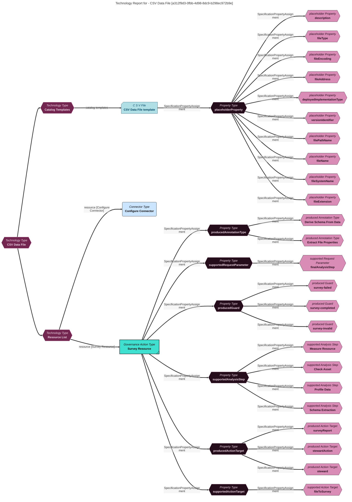

```mermaid
---
title: Technology Report for - CSV Data File [a312f9d3-0fbb-4d98-8dc9-b298ec972b9e]
---
flowchart LR
%%{init: {"flowchart": {"htmlLabels": false}} }%%

1@{ shape: hex, label: "*Technology Type*
**CSV Data File**"}
2@{ shape: hex, label: "*Technology Type*
**Catalog Templates**"}
1==>2
3@{ shape: card, label: "*C S V File*
**CSV Data File template**"}
2==>|"catalog templates"|3
4@{ shape: hex, label: "*Property Type*
**placeholderProperty**"}
3==>|"SpecificationPropertyAssignment"|4
5@{ shape: hex, label: "*placeholder Property*
**description**"}
4==>|"SpecificationPropertyAssignment"|5
6@{ shape: hex, label: "*placeholder Property*
**fileType**"}
4==>|"SpecificationPropertyAssignment"|6
7@{ shape: hex, label: "*placeholder Property*
**fileEncoding**"}
4==>|"SpecificationPropertyAssignment"|7
8@{ shape: hex, label: "*placeholder Property*
**fileAddress**"}
4==>|"SpecificationPropertyAssignment"|8
9@{ shape: hex, label: "*placeholder Property*
**deployedImplementationType**"}
4==>|"SpecificationPropertyAssignment"|9
10@{ shape: hex, label: "*placeholder Property*
**versionIdentifier**"}
4==>|"SpecificationPropertyAssignment"|10
11@{ shape: hex, label: "*placeholder Property*
**filePathName**"}
4==>|"SpecificationPropertyAssignment"|11
12@{ shape: hex, label: "*placeholder Property*
**fileName**"}
4==>|"SpecificationPropertyAssignment"|12
13@{ shape: hex, label: "*placeholder Property*
**fileSystemName**"}
4==>|"SpecificationPropertyAssignment"|13
14@{ shape: hex, label: "*placeholder Property*
**fileExtension**"}
4==>|"SpecificationPropertyAssignment"|14
15@{ shape: hex, label: "*Technology Type*
**Resource List**"}
1==>15
16@{ shape: rounded, label: "*Connector Type*
**Configure Connector**"}
15==>|"resource [Configure Connector]"|16
17@{ shape: tag-rect, label: "*Governance Action Type*
**Survey Resource**"}
15==>|"resource [Survey Resource]"|17
18@{ shape: hex, label: "*Property Type*
**producedAnnotationType**"}
17==>|"SpecificationPropertyAssignment"|18
19@{ shape: hex, label: "*produced Annotation Type*
**Derive Schema From Data**"}
18==>|"SpecificationPropertyAssignment"|19
20@{ shape: hex, label: "*produced Annotation Type*
**Extract File Properties**"}
18==>|"SpecificationPropertyAssignment"|20
21@{ shape: hex, label: "*Property Type*
**supportedRequestParameter**"}
17==>|"SpecificationPropertyAssignment"|21
22@{ shape: hex, label: "*supported Request Parameter*
**finalAnalysisStep**"}
21==>|"SpecificationPropertyAssignment"|22
23@{ shape: hex, label: "*Property Type*
**producedGuard**"}
17==>|"SpecificationPropertyAssignment"|23
24@{ shape: hex, label: "*produced Guard*
**survey-failed**"}
23==>|"SpecificationPropertyAssignment"|24
25@{ shape: hex, label: "*produced Guard*
**survey-completed**"}
23==>|"SpecificationPropertyAssignment"|25
26@{ shape: hex, label: "*produced Guard*
**survey-invalid**"}
23==>|"SpecificationPropertyAssignment"|26
27@{ shape: hex, label: "*Property Type*
**supportedAnalysisStep**"}
17==>|"SpecificationPropertyAssignment"|27
28@{ shape: hex, label: "*supported Analysis Step*
**Measure Resource**"}
27==>|"SpecificationPropertyAssignment"|28
29@{ shape: hex, label: "*supported Analysis Step*
**Check Asset**"}
27==>|"SpecificationPropertyAssignment"|29
30@{ shape: hex, label: "*supported Analysis Step*
**Profile Data**"}
27==>|"SpecificationPropertyAssignment"|30
31@{ shape: hex, label: "*supported Analysis Step*
**Schema Extraction**"}
27==>|"SpecificationPropertyAssignment"|31
32@{ shape: hex, label: "*Property Type*
**producedActionTarget**"}
17==>|"SpecificationPropertyAssignment"|32
33@{ shape: hex, label: "*produced Action Target*
**surveyReport**"}
32==>|"SpecificationPropertyAssignment"|33
34@{ shape: hex, label: "*produced Action Target*
**stewardAction**"}
32==>|"SpecificationPropertyAssignment"|34
35@{ shape: hex, label: "*produced Action Target*
**steward**"}
32==>|"SpecificationPropertyAssignment"|35
36@{ shape: hex, label: "*Property Type*
**supportedActionTarget**"}
17==>|"SpecificationPropertyAssignment"|36
37@{ shape: hex, label: "*supported Action Target*
**fileToSurvey**"}
36==>|"SpecificationPropertyAssignment"|37
style 22 color:#260d1b, fill:#d98cb6, stroke:#260d1b
style 23 color:#f2d9e7, fill:#260d1b, stroke:#f2d9e7
style 24 color:#260d1b, fill:#d98cb6, stroke:#260d1b
style 25 color:#260d1b, fill:#d98cb6, stroke:#260d1b
style 26 color:#260d1b, fill:#d98cb6, stroke:#260d1b
style 27 color:#f2d9e7, fill:#260d1b, stroke:#f2d9e7
style 28 color:#260d1b, fill:#d98cb6, stroke:#260d1b
style 29 color:#260d1b, fill:#d98cb6, stroke:#260d1b
style 30 color:#260d1b, fill:#d98cb6, stroke:#260d1b
style 31 color:#260d1b, fill:#d98cb6, stroke:#260d1b
style 10 color:#260d1b, fill:#d98cb6, stroke:#260d1b
style 32 color:#f2d9e7, fill:#260d1b, stroke:#f2d9e7
style 11 color:#260d1b, fill:#d98cb6, stroke:#260d1b
style 33 color:#260d1b, fill:#d98cb6, stroke:#260d1b
style 12 color:#260d1b, fill:#d98cb6, stroke:#260d1b
style 34 color:#260d1b, fill:#d98cb6, stroke:#260d1b
style 13 color:#260d1b, fill:#d98cb6, stroke:#260d1b
style 35 color:#260d1b, fill:#d98cb6, stroke:#260d1b
style 14 color:#260d1b, fill:#d98cb6, stroke:#260d1b
style 36 color:#f2d9e7, fill:#260d1b, stroke:#f2d9e7
style 15 color:#f2d9e7, fill:#732650, stroke:#f2d9e7
style 37 color:#260d1b, fill:#d98cb6, stroke:#260d1b
style 16 color:#000000, fill:#CCE5FF, stroke:#000000
style 17 color:#000000, fill:#40E0D0, stroke:#000000
style 18 color:#f2d9e7, fill:#260d1b, stroke:#f2d9e7
style 19 color:#260d1b, fill:#d98cb6, stroke:#260d1b
style 1 color:#f2d9e7, fill:#732650, stroke:#f2d9e7
style 2 color:#f2d9e7, fill:#732650, stroke:#f2d9e7
style 3 color:#004563, fill:#b0e0e6, stroke:#004563
style 4 color:#f2d9e7, fill:#260d1b, stroke:#f2d9e7
style 5 color:#260d1b, fill:#d98cb6, stroke:#260d1b
style 6 color:#260d1b, fill:#d98cb6, stroke:#260d1b
style 7 color:#260d1b, fill:#d98cb6, stroke:#260d1b
style 8 color:#260d1b, fill:#d98cb6, stroke:#260d1b
style 9 color:#260d1b, fill:#d98cb6, stroke:#260d1b
style 20 color:#260d1b, fill:#d98cb6, stroke:#260d1b
style 21 color:#f2d9e7, fill:#260d1b, stroke:#f2d9e7
```
